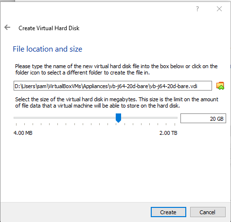
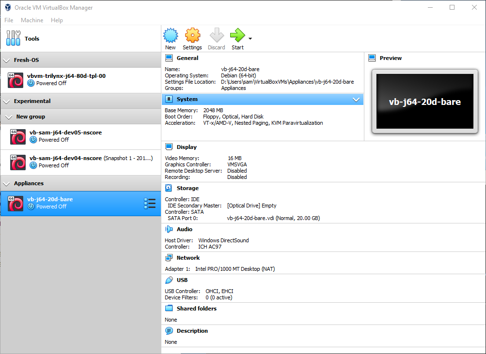
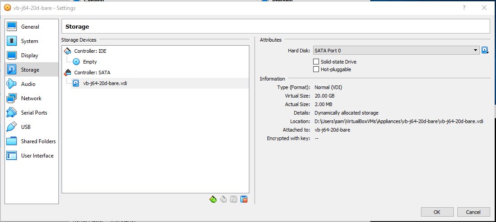
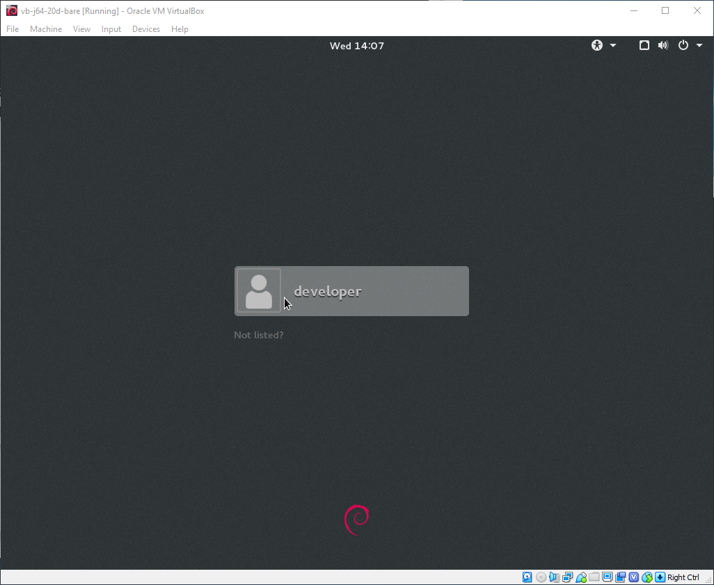
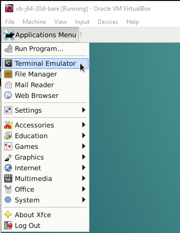

# VirtualBox / Windows 10 Host / Create Linux Debian Jessie Guest VM

This documentation describes how to create a new Linux Debian Jessie guest operating system VM
installed on a Windows 10 host operating system, using Virtual Box 6.0.4.
The Debian Linux distribution is known for its stability.
Therefore it may not have the latest software tools or versions,
but the software that is available is very stable, which is important for critical operational systems.

* [Planning](#planning)
* [Start VirtualBox Manager](#start-virtualbox-manager)
* [System Name and Type](#system-name-and-type)
* [Memory Size](#memory-size)
* [Hard Disk](#hard-disk)
* [General Configuration](#general-configuration)
* [Network Configuration](#network-configuration)
* [Display Configuration](#display-configuration)
* [Install Guest Operating System](#install-guest-operating-system)
* [Configure Guest Operating System](#configure-guest-operating-system)
* [Install Guest Additions](#install-guest-additions)
* [Install Additional Software](#install-additional-software)
* [Next Steps](#next-steps)

----------------------

## Planning ##

Before creating a new virtual machine guest, it is worth doing some planning.
For example, rather than going through the trouble of creating a new guest VM and installing Linux from a distribution (distro),
consider the options (most effort listed first):

* create a new VM from scratch by installing Linux distribution
	+ pros:  full control over VM, may be needed to install a specific version
	+ cons:  takes awhile and may need to recreate if mistakes are made
* import an appliance VM
	+ pros:  fast, promotes standardization
	+ cons:  suitable appliance VM must be available
	+ see: [Import Linux Debian Jessie VM Appliance](../../import-appliance/linux-debian-jessie/import-appliance-debian-jessie.md)
* copy an existing VM
	+ pros:  fast
	+ cons:  existing VM may be "polluted" with software and other files

Within an organization or development team, dedicating resources to creating an appliance
can pay off in the long run because multiple people can create a new VM using the appliance and
save time for each VM that is created.
A standard appliance also promotes consistency.

If a new VM does need to be created, then following the instructions on this page.

## Start VirtualBox Manager

The ***VirtualBox Manager*** should be run as a normal user (not administrator) when setting
up a virtual machine (VM) because the virtual hard disk is stored in a user's files.
If at any point during installation and configuration file and folder paths include `admin` as the user,
then it is likely that the ***VirtualBox Manager*** is not being run using a normal login.

## System Name and Type ##

Start adding a new virtual machine by using the ***Machine / New...*** menu, which displays the following dialog.
The example below uses default ***Machine Folder***.
This is the default top-level folder under which more specific folders will be created in a later step when the hard disk location is specified.

**<p style="text-align: center;">

</p>**

**<p style="text-align: center;">
Create Virtual Machine for Debian Jessie - Default Machine Folder (<a href="../images/new-debian-jessie1-name.png">see full-size image</a>)
</p>**

The example below shows an alternate location on the `D:` drive, which has more space available.
Folders that match `C:` drive user files are used for consistency.
The folder, once defined, becomes the default top-level folder under which more specific folders
will be created in a later step when the hard disk location is specified.

**<p style="text-align: center;">

</p>**

**<p style="text-align: center;">
Create Virtual Machine for Debian Jessie - Alternate Machine Folder (<a href="../images/new-debian-jessie1b-name.png">see full-size image</a>)
</p>**

The example below shows an appliance VM with bare operating system that can be further configured:

**<p style="text-align: center;">

</p>**

**<p style="text-align: center;">
Create Virtual Machine for Debian Jessie - Appliance Example (<a href="../images/new-debian-jessie1b2-name.png">see full-size image</a>)
</p>**

The specific information for a Linux Debian Jessie installation includes, the following,
with example values for illustration.
The actual name used should match the needs within an organization.

* ***Name*** - virtual machine name that will be listed in ***VirtualBox Manager***
	+ Does not need to match the hostname of the machine once it is configured.
	Using the same name may result in a long hostname but can avoid confusion.
	+ In the second example shown, in this case a development environment for a software product:
		- `vb` indicates VirtualBox compared to other hardware that may be used in a network.
		- `sam` indicates the user.
		- `j64` indicates Jessie 64-bit.
		- `dev04` indicates the fourth development machine to differentiate from other
		development machines.
		- `nscore` indicates the software product development environment.
		- `20d` indicates a VM that uses 20GB dynamic drive.
		- `bare` indicates a minimal bare operating system VM.
	+ Because multiple VMs can be defined,
	it is useful to use a VM name (and host name, once installed) that are consistent
	with computing environment standards and uniquely identify the VM in the local network.
	The machine name parts above should be unique between all users/developers on the system.
	+ Consider using a name that is consistent with the purpose of the machine, such as
	`dev`, `test`, `build`, `support`, etc.
	+ If creating an appliance to be imported later, a general name like
	`vb-j64-20d-bare` might be used to indicate VirtualBox, Debian Jessie 64,
	20 GB dynamic drive, bare operating system.  Or, be more explicit for appliance VM names
	and include the organization name, such as
	`vb-myorg-debian-jessie-64-20d-bare`, which can then be imported to create a specific VM for a user,
	such as `vb-user-j64-20d-xxx` (where `xxx` is a product or environment).
	+ The VM names that are used should generally also be used for the virtual hard drive,
	image `OVA` file, and hostname, to avoid confusion.
* ***Machine Folder*** - folder on Windows 10 where the virtual machine files will be saved
	+ By default, the location will be similar to `C:\Users\user\Virtual Box VMs`.
	The default is OK if the default `C:\` hard drive is sufficiently large.
	However, in this example a different hard drive is specified that provides more space.
	+ This folder will contain the relatively small configuration files for the VMs.
	+ A later step will also use this folder for virtual hard drives, so that all VM files are
	in the same location.
* ***Type*** - guest operating system type, in this case ***Linux***
* ***Version*** - Linux distribution, in this case ***Debian (64-bit)***

Press ***Next*** to continue with setup.

## Memory Size ##

The VM system memory can be changed later but should be set at a reasonable initial level:

* The memory allocated to the VM will **not be available** to the host operating system.
* Specify enough memory to perform the tasks that need to be run on the VM.
* A product VM used by multiple users (e.g., web server) may need to be sized for more memory
to accommodate unforeseen spikes in processes.
* The memory setting should take into account the total amount of memory on the machine and
the number of concurrent VMs that may be run on the machine above the host operating system.
Use the Windows ***System Information*** tool to check how much memory is available.

The following example uses a memory size of 2GB (2048 MB),
which is more than the default of 1024 MB, on a host machine that has 16 GB of memory.

**<p style="text-align: center;">

</p>**

**<p style="text-align: center;">
Create Virtual Machine for Debian Jessie - Memory Size (<a href="../images/new-debian-jessie2.png">see full-size image</a>)
</p>**

Press ***Next*** to continue with setup.

## Hard Disk ##

The VM hard disk exists as a file on the host operating system.
The VM hard disk size can be configured by selecting from a spectrum of options from simple to complex.
In most cases, a simple approach is adequate.

* A fixed-size file can be allocated large enough for envisioned needs and cannot be resized.
However, the size will decrease the disk space available to the host operating system.
* A dynamically allocated file will only grow in size when the guest operating system
stores data on the virtual hard disk.
If the upper limit can be reasonably estimated, then a dynamically allocated file is a good option.
For example, use smaller number (e.g., 20 GB) for a development machine and a larger number
(e.g., 80 GB) for database server with multiple large databases.
* The disk space setting and number of VMs should take into account the total amount of hard disk on the machine and
the number of VMs that may be configured on the machine in addition to the host operating system.
Use the Windows ***System Information*** or other tool to check how much disk space is available.
VMs that are no longer needed can be deleted to free up disk space.
For example, if software files are stored in repositories, they can be restored as needed on new VMs.

The following example uses a dynamically allocated hard drive with maximum of 20 GB,
which is more than the default of 8 GB, on a Windows host machine that has a 1TB second (`D:`) hard drive.

First, indicate that a virtual hard disk should be created:

**<p style="text-align: center;">

</p>**

**<p style="text-align: center;">
Create Virtual Machine for Debian Jessie - Create Hard Drive (<a href="../images/new-debian-jessie3-storage.png">see full-size image</a>)
</p>**

Press ***Create*** to continue with setup.

Next, indicate the type of virtual hard disk should be created.
The default type ***VDI*** is appropriate if the hard disk will only be used on the local VirtualBox machine.
If the virtual hard disk will be copied from the VirtualBox machine to another virtual machine,
such as Amazon Web Services or Google Cloud Platform VM, then one of the other types can be selected.

**<p style="text-align: center;">

</p>**

**<p style="text-align: center;">
Create Virtual Machine for Debian Jessie - Hard Drive Type (<a href="../images/new-debian-jessie4-storage.png">see full-size image</a>)
</p>**

Press ***Next*** to continue with setup.

Next, indicate how the storage will be allocated.
The default setting of ***Dynamically allocated*** is generally a good option because it limits the
amount of disk space on the host operating system to files that are actually saved.
The maximum size of the dynamically sized disk can be specified in the next step.

**<p style="text-align: center;">

</p>**

**<p style="text-align: center;">
Create Virtual Machine for Debian Jessie - Storage Allocation (<a href="../images/new-debian-jessie5-storage.png">see full-size image</a>)
</p>**

Press ***Next*** to continue with setup.

Next, indicate the name of the virtual hard disk file name and location.
The default disk name is the name of the virtual machine,
stored in the default location for virtual machines, which on Windows 10,
is `C:\Users\user\VirtualBox VMs`.
This default is OK if the Windows `C:` drive has sufficient space.
An alternate drive could be used, as show below,
for example by creating a folder `D:\Users\user\Virtual Box VMs`
(or remove spaces with `D:\Users\user\VirtualBoxVMs`) and then
using the virtual hard disk name that matches the VM name.

Because the default interface only shows a filename, the file location is confusing.
Therefore, use the file browser to show the full path.
A general guideline is to use the following folder structure to organize VM files.

```
C:/  (or another drive where space is available)
    Users/
        user/
            VirtualBox VMs/   (or VirtualBoxVMs)
                GroupName/
                    VMName/
	                VMName.vdi
```

**<p style="text-align: center;">

</p>**

**<p style="text-align: center;">
Create Virtual Machine for Debian Jessie - File Location and Size (<a href="../images/new-debian-jessie6-storage.png">see full-size image</a>)
</p>**

The following example is for an appliance, where the Group and VM name correspond to folders.
Using a folder in the path that matches the VM name ensures that multiple files used for the VM are isolated from other VMs.
Files will include the virtual hard disk (`*.vdi`) and VirtualBox software settings (`*.vbox` and `*.vbox-prev`).
**Warning:  Do not type a new folder name in the file browser (one that does not exist) because this will confuse ***VirtualBox Manager***.
Instead, if necessary use an existing group and move the VM to another group after the VM is created.**

**<p style="text-align: center;">

</p>**

**<p style="text-align: center;">
Create Virtual Machine for Debian Jessie - File Location and Size for Appliance (<a href="../images/new-debian-jessie6b-storage.png">see full-size image</a>)
</p>**

**Based on experience, it appears that it is best to let VirtualBox deal with folders itself as part of group assignment.
An exception is when a disk should be saved in a location that for a VM that is shared among users.
Use the VirtualBox Manager to create groups, assign VMs to groups, and mv VMs between groups.
If the VMs and associated hard disck are named consistently and uniquely, there should be no collisions.**

Press ***Create*** to create the virtual hard disk.

The virtual machine will then be listed in the ***VirtualBox Manager*** similar to the following.

**<p style="text-align: center;">

</p>**

**<p style="text-align: center;">
Create Virtual Machine for Debian Jessie - Complete (<a href="../images/new-debian-jessie7-manager.png">see full-size image</a>)
</p>**

The following shows an appliance VM where the VM folder matches the group and VM name:

**<p style="text-align: center;">

</p>**

**<p style="text-align: center;">
Create Virtual Appliance Machine for Debian Jessie - Complete (<a href="../images/new-debian-jessie7b-manager.png">see full-size image</a>)
</p>**

Viewing the ***Storage*** properties shows the following.  Click on ***Controller: SATA/***`vb-sam-j64-dev04-nscore.vdi`
or similar to display hard disk information.
Note that the actual size is initially only 2 MB.

**<p style="text-align: center;">

</p>**

**<p style="text-align: center;">
Create Virtual Machine for Debian Jessie - Storage Information (<a href="../images/new-debian-jessie8-storage.png">see full-size image</a>)
</p>**

The following example shows hard disk information for an appliance where the file location includes
group and machine name folders.

**<p style="text-align: center;">

</p>**

**<p style="text-align: center;">
Create Appliance Virtual Machine for Debian Jessie - Storage Information (<a href="../images/new-debian-jessie8b-storage.png">see full-size image</a>)
</p>**

Next, configure the VM before installing the guest operating system.

## General Configuration ##

It is helpful to specify ***VirtualBox Manager / General*** configuration information to facilitate interacting with the VM.
In the following, specify:

* ***Shared Clipboard:  Bidirectional***
* ***Drag'n'Drop:  Bidirectional***

**<p style="text-align: center;">

</p>**

**<p style="text-align: center;">
Create Virtual Machine for Debian Jessie - General Configuration (<a href="../images/new-debian-jessie8a-general.png">see full-size image</a>)
</p>**

## Network Configuration ##

Use the following ***VirtualBox Manager / Network*** settings, and otherwise use defaults.

* ***Attached to:***  use ***Bridged Adapter*** to allow the virtual machine to communicate with other machines on the local network.

* ***Name:*** - the default shown should be OK

**<p style="text-align: center;">

</p>**

**<p style="text-align: center;">
Virtual Machine - Network Configuration (<a href="../images/new-debian-jessie8b-network.png">see full-size image</a>)
</p>**

## Display Configuration ##

Use the ***VirtualBox Manager / Display*** properties to configure display settings.
The display configuration is important because if not specified correctly, the guest additions installed later
that provide integration between guest and host operating system may not work correctly.

* ***Graphics Controller*** - Based on experience with Debian Jessie and Virtual Box 6,
it is recommended that the ***Graphics Controller*** is specified as `VBoxVGA`, as shown below.
This may not be the default (e.g., `VMSVGA` may be the default but is not a good choice).

* ***Video Memory*** - can be set to a high level such as 128MB to increase performance.

* ***Monitor Count*** can be set to the number of monitors, but this can be changed after installing and confirming that
guest additions work.  When guest additions are configured the VM window can be stretched across monitors
even without setting the count because Windows 10 will control the window within the host operating system.
Therefore, use the default value.

* ***Enable 3D Acceleration*** should **not be selected** because experience has shown that acceleration can cause display issues.

**<p style="text-align: center;">

</p>**

**<p style="text-align: center;">
Virtual Machine - Display Configuration (<a href="../images/new-debian-jessie8c-display.png">see full-size image</a>)
</p>**

## Install Guest Operating System ##

**Make sure to configure the network and display before installing the operating system.
This will ensure that the network can be accessed to download software,
for example with `apt-get` for Linux, and the display supports guest additions.**

Previous steps have created a virtual machine.  However, the guest operating system has not yet been installed on that VM.
This is accomplished by mounting an ISO image of the guest operating system as the guest operating system CD.
First, download the guest operating system from the following as an ISO image file:

* Debian Jessie:
	+ [https://www.debian.org/releases/jessie/debian-installer/](https://www.debian.org/releases/jessie/debian-installer/)
	+ Under ***netinst CD image***, click on ***amd64*** for 64-bit distribution
	+ This will download a filename similar to `debian-8.11.0-amd64-netinst.iso`.

Next, mount the ISO file on the VM CD drive.  Select the ***Storage*** item for the virtual machine.
Then select the ***Controller:  IDE*** item by clicking on on the CD symbol (should say ***Empty*** initially).
Then click on the CD icon to the right of ***Optical Drive*** choice by clicking on the CD icon, as shown below.

**<p style="text-align: center;">

</p>**

**<p style="text-align: center;">
Install Debian Jessie from ISO - Mount CD (<a href="../images/new-debian-jessie9-distro.png">see full-size image</a>)
</p>**

Select the `debian-8.11.0-amd64-netinst.iso` file that was previously downloaded and press ***Open*** in the file selector,
which will result in the ISO file being listed next to the ***Controller:  IDE/ CD*** icon, as shown below.

**<p style="text-align: center;">

</p>**

**<p style="text-align: center;">
Install Debian Jessie from ISO - CD Mounted (<a href="../images/new-debian-jessie10-cdrom.png">see full-size image</a>)
</p>**

Press ***OK*** to close the ***Storage*** window.

Make sure that the VM is selected (highlighted) in the ***VirtualBox Manager*** and press ***Start***.
A screen similar to the following will be shown.
Warnings about "capture keyboard" may be shown.  These warnings can be acknowledge by clicking on the ***X*** and
will be resolved as the installation process is completed.

It is recommended that the ***Install*** option be used, which provides simple text-based selections.

**<p style="text-align: center;">

</p>**

**<p style="text-align: center;">
Install Debian Jessie (<a href="../images/new-debian-jessie11-debian-install.png">see full-size image</a>)
</p>**

Use the ***Enter*** key to start installing the Debian Jessie operating system on the virtual machine.

The following may be shown and will be addressed through configuration later.

**<p style="text-align: center;">

</p>**

**<p style="text-align: center;">
Install Debian Jessie - Capture Warning (<a href="../images/new-debian-jessie12-debian-install2.png">see full-size image</a>)
</p>**

Select ***Capture*** and optionally ***Do not show this message again*** to continue.

Select the language as shown in the following.

**<p style="text-align: center;">

</p>**

**<p style="text-align: center;">
Install Debian Jessie - Language (<a href="../images/new-debian-jessie13-language.png">see full-size image</a>)
</p>**

Press ***Enter*** to continue.

Select the location as shown in the following.

**<p style="text-align: center;">

</p>**

**<p style="text-align: center;">
Install Debian Jessie - Location (<a href="../images/new-debian-jessie14-location.png">see full-size image</a>)
</p>**

Press ***Enter*** to continue.

Select the keyboard as shown in the following.

**<p style="text-align: center;">

</p>**

**<p style="text-align: center;">
Install Debian Jessie - Keyboard (<a href="../images/new-debian-jessie15-keyboard.png">see full-size image</a>)
</p>**

Press ***Enter*** to continue.

The software installation progress will be shown as follows and similar progress indicators will be shown
throughout the installation process:

**<p style="text-align: center;">

</p>**

**<p style="text-align: center;">
Install Debian Jessie - Progress (<a href="../images/new-debian-jessie16-progress.png">see full-size image</a>)
</p>**

Specify the hostname as follows, which will be the network name.
In this case the same name is being used for the virtual machine (displayed in ***VirtualBox Manager***)
and the hostname (shown in terminal prompt and as network identifier).
The hostname can be changed later by editing Linux configuration files.

**<p style="text-align: center;">

</p>**

**<p style="text-align: center;">
Install Debian Jessie - Hostname (<a href="../images/new-debian-jessie17-hostname.png">see full-size image</a>)
</p>**

Press ***Enter*** to continue.

Specify the domain name as follows.
Use the actual domain name if one is available for the organization.
Otherwise, make something up that does not conflict with a real-world domain.

**<p style="text-align: center;">

</p>**

**<p style="text-align: center;">
Install Debian Jessie - Domain (<a href="../images/new-debian-jessie18-domain.png">see full-size image</a>)
</p>**

Press ***Enter*** to continue.

Specify the root password.
Make sure to record somewhere because if lost the VM may need to be recreated to gain root permissions.
If creating an appliance, pick a password that can be shared with others.

**<p style="text-align: center;">

</p>**

**<p style="text-align: center;">
Install Debian Jessie - Root Password (<a href="../images/new-debian-jessie19-root.png">see full-size image</a>)
</p>**

Press ***Enter*** to continue.  A second entry screen will ask for confirmation of the password.
Press ***Enter*** to continue.

Next enter a user account for normal user.
First enter the user name (`First Last`), and then the login name and password for the user.
**Make sure to remember the login and password**.  If they are forgotten, use the root login to reset the password later.
If creating a VM appliance, a generic account can be added, for example `developer` for software developer environment.

Specify the time zone for the computer as shown below.

**<p style="text-align: center;">

</p>**

**<p style="text-align: center;">
Install Debian Jessie - Time Zone (<a href="../images/new-debian-jessie20-timezone.png">see full-size image</a>)
</p>**

Press ***Enter*** to continue.

Next configure hard disk partitioning.
The default is usually accpetable.

**<p style="text-align: center;">

</p>**

**<p style="text-align: center;">
Install Debian Jessie - Disk Partitioning (<a href="../images/new-debian-jessie21-disk-partitioning.png">see full-size image</a>)
</p>**

Press ***Enter*** to continue.

Select the disk to partition, as follows:
The default is usually acceptable.

**<p style="text-align: center;">

</p>**

**<p style="text-align: center;">
Install Debian Jessie - Disk Partition Selection (<a href="../images/new-debian-jessie22-disk-partitioning2.png">see full-size image</a>)
</p>**

Press ***Enter*** to continue.

Indicate the partitioning scheme as follows.
The default is usually acceptable.

**<p style="text-align: center;">

</p>**

**<p style="text-align: center;">
Install Debian Jessie - Disk Partition Scheme (<a href="../images/new-debian-jessie23-disk-partitioning3.png">see full-size image</a>)
</p>**

Press ***Enter*** to continue.

The following is shown to confirm the configuration.

**<p style="text-align: center;">

</p>**

**<p style="text-align: center;">
Install Debian Jessie - Disk Partition Confirmation (<a href="../images/new-debian-jessie24-disk-partitioning4.png">see full-size image</a>)
</p>**

Press ***Enter*** to continue.

Another confirmation is then shown.
**Make sure to select ***Yes*** **.

**<p style="text-align: center;">

</p>**

**<p style="text-align: center;">
Install Debian Jessie - Disk Partition Confirmation 2 (<a href="../images/new-debian-jessie25-disk-partitioning5.png">see full-size image</a>)
</p>**

Press ***Enter*** to continue.  The operating system will then be extracted onto the file system, with progress shown as below.

**<p style="text-align: center;">

</p>**

**<p style="text-align: center;">
Install Debian Jessie - Install Operating System (<a href="../images/new-debian-jessie26-install-os.png">see full-size image</a>)
</p>**

Additional software will be installed from the internet.
Select the Debian archive country location as shown below.

**<p style="text-align: center;">

</p>**

**<p style="text-align: center;">
Install Debian Jessie - Install Operating System Mirror Country (<a href="../images/new-debian-jessie27-install-os2.png">see full-size image</a>)
</p>**

Press ***Enter*** to continue.
Then select the mirror archive as below.

**<p style="text-align: center;">

</p>**

**<p style="text-align: center;">
Install Debian Jessie - Install Operating System Mirror (<a href="../images/new-debian-jessie28-install-os3.png">see full-size image</a>)
</p>**

Press ***Enter*** to continue.

If the network configuration requires using a proxy for downloads, specify a proxy in the following form.
Otherwise, leave blank.

**<p style="text-align: center;">

</p>**

**<p style="text-align: center;">
Install Debian Jessie - Network Proxy (<a href="../images/new-debian-jessie29-proxy.png">see full-size image</a>)
</p>**

Press ***Enter*** to continue.

Additional software installation will occur.

Indicate whether usage statistics should be supplied to Debian developers.

**<p style="text-align: center;">

</p>**

**<p style="text-align: center;">
Install Debian Jessie - Network Proxy (<a href="../images/new-debian-jessie30-statistics.png">see full-size image</a>)
</p>**

Press ***Enter*** to continue.

Select the software to install.  Use the arrows to move the cursor and the space bar to select/deselect software.
Additional software can be installed later if necessary.
The following are typical selections.

**<p style="text-align: center;">

</p>**

**<p style="text-align: center;">
Install Debian Jessie - Additional Software (<a href="../images/new-debian-jessie31-software.png">see full-size image</a>)
</p>**

* ***Debian desktop environment***
	+ useful for desktop VMs that will be used for software development or other interactive tasks
	+ not required for pure server environment that will only be accessed through `ssh`
	+ ***GNOME*** may be used in some systems but does have some issues - install if the deployed system requires it
	+ ***Xfce*** is a popular desktop environment and is recommended
* ***SSH Server***
	+ needed for remote access
* ***standard system utilities***
	+ needed for typical Linux operations
	+ requires editing `/etc/ssh` files to complete setup

Press ***Enter*** to continue with the software installation.

The default display manager ***gdm3*** is OK.  This is used for the initial login screen.

**<p style="text-align: center;">

</p>**

**<p style="text-align: center;">
Install Debian Jessie - Display Manager (<a href="../images/new-debian-jessie32-display-manager.png">see full-size image</a>)
</p>**

Press ***Enter*** to continue.

Install the GRUB boot loader as follows.
The information shows refers to the VM, not the original host operating system.

**<p style="text-align: center;">

</p>**

**<p style="text-align: center;">
Install Debian Jessie - Boot Loader (<a href="../images/new-debian-jessie33-grub.png">see full-size image</a>)
</p>**

Press ***Enter*** to continue.

Specify the device for the GRUB boot loader as follows.
**Select the hard disk rather than entering the device manually.**

**<p style="text-align: center;">

</p>**

**<p style="text-align: center;">
Install Debian Jessie - Boot Loader Device (<a href="../images/new-debian-jessie34-grub-device.png">see full-size image</a>)
</p>**

Press ***Enter*** to continue.

The following message indicates that the installion is complete and is ready for login.

**<p style="text-align: center;">

</p>**

**<p style="text-align: center;">
Install Debian Jessie - Installation Complete (<a href="../images/new-debian-jessie35-complete.png">see full-size image</a>)
</p>**

Check the ***Storage*** information in the ***VirtualBox Manager*** to make sure the CD drive is not mounted.
Press ***Enter*** to continue.
The Debian Linux VM should boot.

## Configure Guest Operating System ##

After the guest operating system has installed, it is necessary to complete its configuration.
The following is an example login screen for a VM appliance with `developer` user.

**<p style="text-align: center;">

</p>**

**<p style="text-align: center;">
Install Debian Jessie - Login Screen (<a href="../images/new-debian-jessie35b-login.png">see full-size image</a>)
</p>**

Login as the normal user (not root).  If prompted, ***Use default config*** for the "first start of the panel" as shown below.
This defines how many virtual desktop panels are used by the window manager.

**<p style="text-align: center;">

</p>**

**<p style="text-align: center;">
Install Debian Jessie - Installation Complete (<a href="../images/new-debian-jessie36-panel.png">see full-size image</a>)
</p>**

In order to perform system configuration, the normal user needs to have "sudo" permissions.
Therefore, install and configure sudo as follows.
First open a terminal emulator from the ***Applications Menu*** as shown in the following figure.

**<p style="text-align: center;">

</p>**

**<p style="text-align: center;">
Install Debian Jessie - Open Terminal Winddow (<a href="../images/new-debian-jessie35c-terminal.png">see full-size image</a>)
</p>**

Use the terminal command line to switch user to root.
The `sudo` software will be installed and then add the normal user as a "sudo user"
(account with administrative permissions).
This allows the normal user to perform administrative tasks when necessary
by later running `sudo command...`.
The last step in the following will add the normal user as a sudo user.
Specify the login for the user that was added during the installation process.

```
$ su root
$ apt-get update
$ apt-get install sudo
$ adduser <user> sudo
```

For example, the last command for `developer` user would be:

```
$ adduser developer sudo
```

Logout of the session and login again as the normal user to have sudo permissions for the remaining configuration,
including configuration of guest additions.

## Install Guest Additions ##

Guest additions software allows the guest operating system to integrate with the host operating system,
including keyboard, mouse, copy/paste features, improved use of the display, and other device integration.
A clear sign that guest additions are not installed is if resizing the VM window results in
no change in size of the desktop, with padding border around the desktop.

There are two philosophies when creating an appliance for use by others:

1. Install as little software as possible, and **no guest additions**
	* pros: allows use of the VM to configure variations
	* cons: if guest additions are not installed,
	effort is required to install later
2. Install a minimal amount of software, including guest additions
	* pros: VM can be used more quickly without re-installing the software
	* cons: if installed software is not as needed,
	may need to have to recreate the VM, uninstall software, or reinstall software

It is helpful at this point to take a snapshot of the state of the VM in case there is a need to roll back any of the
following changes.  It is generally best to take a snapshot only when a system is shut down to ensure a static image.
To take a snapshot, use ***VirtualBox Manager / Machine / Tools / Snapshots*** menu.
Then use the ***Take*** tool to create a snapshot.
Name the snapshot accordingly (e.g., `Snapshot 1 - 2019-03-21 - before guest additions`).

The first step in adding guest additions is to install necessary software,
required to build the guest additions for the VM configuration.

1. Start the VM.
2. Login as normal user that has sudo permissions.
3. Open a terminal window.
4. Install necessary software to use guest additions:
	1. `sudo apt-get install build-essential module-assistant`
	2. `sudo apt-get install dkms`
	3. `sudo m-a prepare`

The above will install quite a few additional packages including `gcc` compiler.
These tools are necessary to build the guest additions.
The `m-a` ([module assistant](https://wiki.debian.org/ModuleAssistant))
command may be redundant ensures that the system has header files for the current kernal.

Next, configure to mount the CD with execute permissions.
Many instructions on the internet do not discuss this step but it is necessary
because the default `/etc/fstab` on Debian does not allow CD drive contents to be executable
and therefore the CD installer won't autorun or allow running the install script.

Edit the `/etc/fstab` file using the following,
which assumes knowledge of how to use the `vi` editor.
An alternate editor can be used if necessary but may require installing,
which is why the default `vi` editor is used.
Also note that the enhanced `vi` called `vim` is not installed by default.

```
sudo vi /etc/fstab
```

The following changes will make the VM CD drive executable so that
the guest additions software installer can be run from the CD.
The line before editing will be similar to:

```
/dev/sr0    /media/cdrom0    udf,iso9660 user,noauto    0       0

```

and after editing will be similar to:

```
/dev/sr0    /media/cdrom0    udf,iso9660 user,noauto,exec    0       0
```

Next mount the guest additions ISO on the CD drive.

### Option 1 - Insert CD from Oracle VM VirtualBOx ###

The CD can be inserted using the ***Devices / Insert Guest Additions CD Image...*** menu in the VM window.
This should result in the CD icon being shown on the desktop.
If this does not work, use Option 2 below.

### Option 2 - Insert CD from VirtualBox Manager ###

In ***VirtualBox Manager*** ***Storage*** properties for the VM, click on the CD icon under ***Controller:  IDE***.
Then click on the CD icon on the far right of the dialog and select ***Choose Virtual Optical Disk File...***.
Use the file selector to select the file `C:\Program Files\Oracle\VirtualBox\VBoxGuestAdditions.iso`.
The ***Storage*** properties will then appear similar to the following:

**<p style="text-align: center;">

</p>**

**<p style="text-align: center;">
Install Guest Additions - Guest Additions ISO (<a href="../images/new-debian-jessie37-guest-iso.png">see full-size image</a>)
</p>**

Press ***OK*** to save the settings.
The above should result in a CD image being shown in the VM desktop, similar to the following:

**<p style="text-align: center;">

</p>**

**<p style="text-align: center;">
Install Guest Additions - Desktop CD (<a href="../images/new-debian-jessie38-cdrom.png">see full-size image</a>)
</p>**

### Run the Guest Additions Installer ###

Double-click on the CD icon on the VM desktop to open the ***File Manager***.
This will show a number of files as follows:

**<p style="text-align: center;">

</p>**

**<p style="text-align: center;">
Install Guest Additions - CD Contents(<a href="../images/new-debian-jessie39-cdrom-contents.png">see full-size image</a>)
</p>**

Right-click on `autorun.sh` and select ***Execute*** (requires sudo user password).
If ***Execute*** is not shown, it is an indication that the CD is not properly configured in `/etc/fstab` with `exec` property.
In this case, check the `/etc/fstab` and it may be necessary to restart the VM.
If the file browser does not allow executing,
the file permissions on the CD image are actually probably executable
and the file can be run manually for Linux:

```
$ sudo ./VboxLinuxAdditions.run`
```

The output should install software and indicate `VirtualBox Guest Additions:  Starting.` similar to the following.
The process may take a few minutes.

**<p style="text-align: center;">

</p>**

**<p style="text-align: center;">
Install Guest Additions - Build Guest Additions (<a href="../images/new-debian-jessie39b-build-guest-additions.png">see full-size image</a>)
</p>**

Press ***Return*** to close the terminal window.

Close the ***File Manager***.

Right click on the desktop CD and select ***Eject Volume***.
Shut down the VM using the logout menu and then restart the VM
(actually, may only need to log out and login in again to let the window manager restart).

Login again as the normal user.

Check that guest additions have been installed:  `ls /opt`.
There should be a folder named `/opt/VBoxGuestAdditions-6.0.4` or similar.
Alternatively, check as follows:

```
$ lsmod | grep vboxguest
vboxguest             327680  5 vboxsf
```

Verify that guest additions are working:

* Copy text to/from host/guest operating systems windows.
	+ Right click in the terminal and use the pop-up menu with copy/paste menus
	+ Middle mouse button on some Linux systems defaults to "paste"
* Resize the VM window - the VM desktop should expand to fill the area (may be a slight delay).

If the guest additions are not working, it may be due to the display settings that were originally configured
not being compatible with the guest additions.

## Install Additional Software ##

It is useful to install additional software, as shown below.
`vim` is a text editor that is ubiquitous on Linux and can be used
for system administration tasks.
`chromium` is a web browser that can be used to find information and download software.

```
$ sudo apt-get install vim
$ sudo apt-get install chromium
```

## Next Steps ##

The core VM has now been installed.
The next steps are to install additional software such as development environment tools.
The documentation for these activities varies and separate documentation should be consulted.
For example, the basic VM can be used to export an appliance,
and the appliance can then be imported to create a VM for software development and testing.
