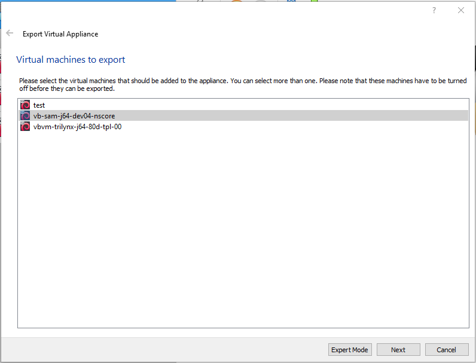
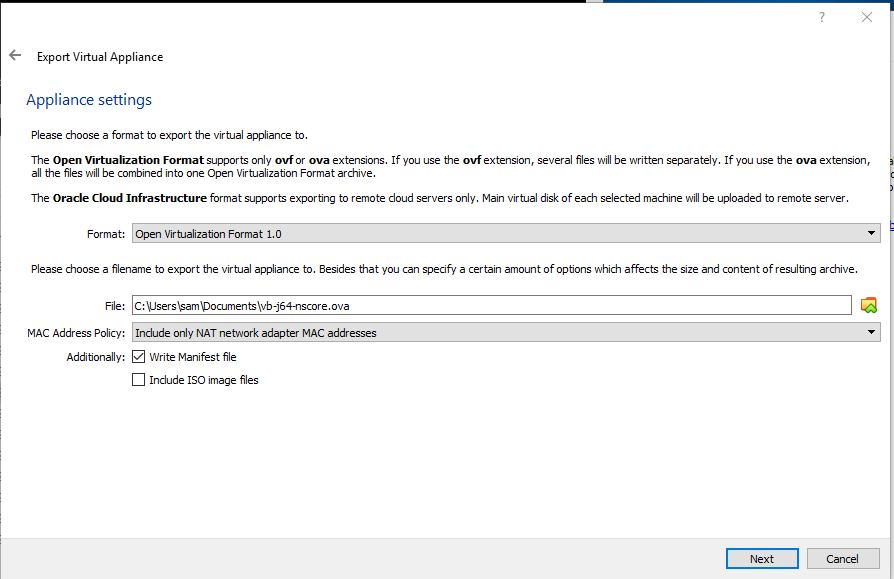
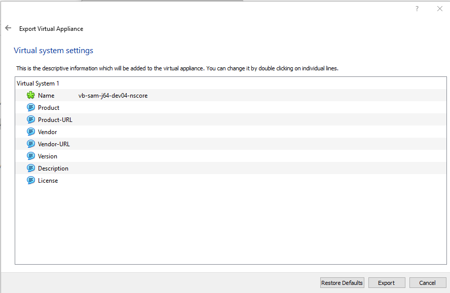
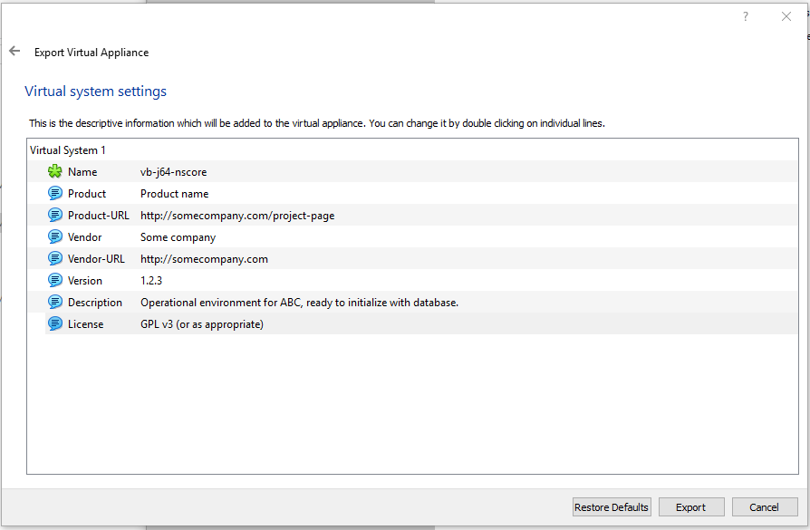
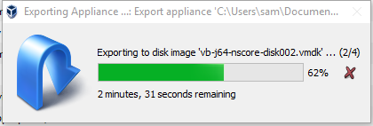
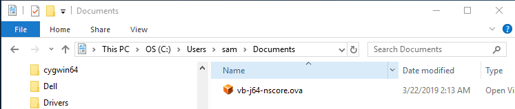

# VirtualBox / Windows Host / Export Linux Debian Jessie VM Appliance #

This documentation was created for Windows 10 and VirtualBox 6.0.4
but should be similar for Windows 11 and newer versions of VitualBox.

Once a VM has been created, it can be exported as an "appliance", which is a self-contained
VM file that can be imported into VirtualBox running on another computer.
This is useful when a standard environment needs to be used on multiple computers,
for example:

*   software development VM - will install software necessary for development,
    such as compilers and integrated development environments
*   software build/testing VM - may build software and test in multiple configurations
*   operational system VM - production system for operations

To export a Linux Debian Jessie appliance, first make sure that the VM is stopped.
Then select the ***VirtualBox Manager / Tools***.

**THE IMAGES IN THIS PAGE NEED TO BE UPDATED.**

Select the ***Export*** tool.  Select the VM to export, as shown in the following image.
When creating an appliance the virtual name should be indicative,
for example `vb-orgname-debian-jessie-64-20d-bare`,
which indicates VirtualBox appliance for a specific organization, Debian Jessie 64 bit, 20 GB dynamic hard drive,
and "bare" indicates bare system with minimal software.

**<p style="text-align: center;">

</p>**

**<p style="text-align: center;">
Export Debian Jessie Virtual Machine (<a href="../images/export-debian-jessie1.png">see full-size image</a>)
</p>**

The default "guided mode" can be used by pressing ***Next***, which uses typical defaults.

The default selections will for the most part be OK.
The name can be long because the VM name will be assigned when importing.  For example, use something like:

```
vb-orgname-debian-jessie-64-20d-bare-2019-01-01.ova
```

The file extension will be consistent with the format.
Using the default `ova` extension results in a single file for the appliance, which simplifies moving the appliance.

**<p style="text-align: center;">

</p>**

**<p style="text-align: center;">
Export Debian Jessie Virtual Machine - Details (<a href="../images/export-debian-jessie2.png">see full-size image</a>)
</p>**

Press ***Next*** to continue.  The following will be shown to configure system settings.
The initial defaults will be similar to the following, where the name matches the VM name that is being exported.
**Need to update the image to use the above name.**

**<p style="text-align: center;">

</p>**

**<p style="text-align: center;">
Export Debian Jessie Virtual Machine - Virtual System Settings (Default) (<a href="../images/export-debian-jessie3.png">see full-size image</a>)
</p>**

Similar to changing the filename, the name of the VM can be changed a general version:

```
vb-orgname-debian-jessie-64-20d-bare
```

This general name can be changed when the appliance is imported later.
Information for the product can also be specified, as shown in the following example.
**Need to update the image to use the above name.**

**<p style="text-align: center;">

</p>**

**<p style="text-align: center;">
Export Debian Jessie Virtual Machine - Virtual System Settings (Specific) (<a href="../images/export-debian-jessie4.png">see full-size image</a>)
</p>**

Press ***Export*** to export the appliance.  A progress bar will be shown.  The export will take a few minutes.

**<p style="text-align: center;">

</p>**

**<p style="text-align: center;">
Export Debian Jessie Virtual Machine - Progress (<a href="../images/export-debian-jessie5-progress.png">see full-size image</a>)
</p>**

The following illustrates the output file. **Need to update the image to use the longer VM name.**

**<p style="text-align: center;">

</p>**

**<p style="text-align: center;">
Export Debian Jessie Virtual Machine - Output File (<a href="../images/export-debian-jessie6-file.png">see full-size image</a>)
</p>**

After exporting the appliance, the file can be placed in a location for downloads.
