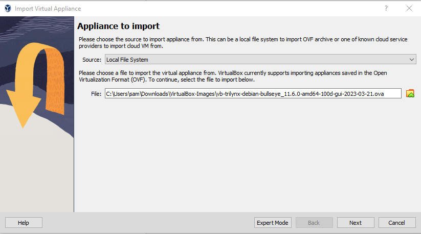
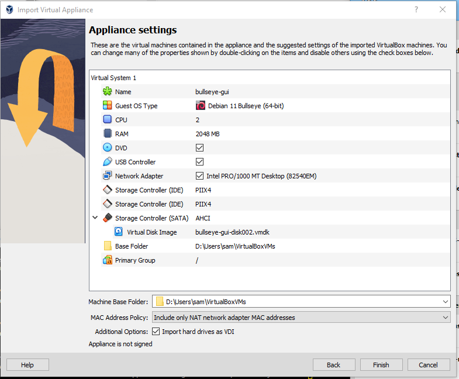
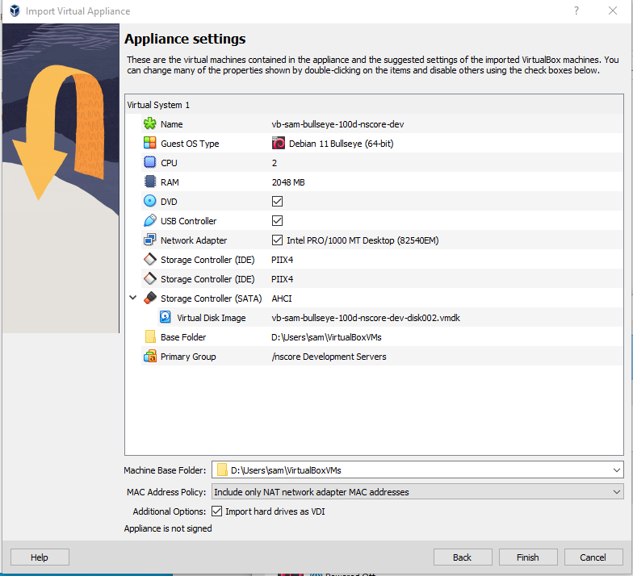
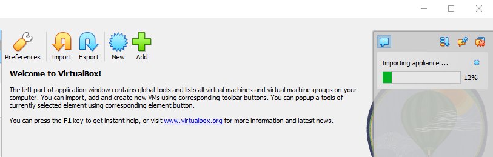
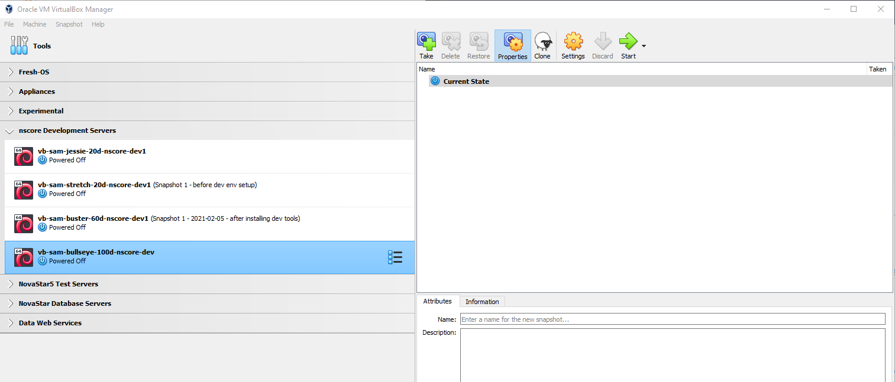

# VirtualBox / Windows 10 Host / Import Linux Debian Bullseye VM Appliance

*   [Introduction](#introduction)
*   [Download Appliance](#download-appliance)
    +   [Check Available Disk Space](#check-available-disk-space)
    +   [Import the Appliance](#import-the-appliance)
    +   [Decide on Virtual Machine Name](#decide-on-virtual-machine-name)

---------------

## Introduction ##

A VM appliance file (e.g., with `ova` or other supported extension) can be imported into a VirtualBox host computer
using the ***VirtualBox Manager***.
This is useful to enable a virtual machine from a standard distribution.
For example, a basic virtual box appliance VM can be created for a target operating system.
The appliance can then be used to configure VMs for the development and production environments,
each of which will install specific software into the VMs created from the appliance.

Snapshots can be saved at various steps of the setup to ensure to facilitate moving forward
with VM software installation.

## Download Appliance ##

To import a VM appliance, first download or otherwise copy the VM appliance file (`ova`)
onto the host operating system computer.
**First check the disk space as discussed below.**

Appliance images are typically created by an organization's IT staff to support the organization
or are provided by a trusted partner.

Images can be hosted in cloud storage to facilitate sharing.
It is recommended to create a "README" file in the image download folder that can be reviewed
before downloading and importing the image.

The following example uses an image file:

```
vb-trilynx-debian-bullseye_11.6.0-amd64-100d-gui-2023-03-21.ova
```

### Filename Conventions ###

The verbose file name has the following parts and provides useful information to differentiate between images:

*   `vb` - for VirtualBox
*   `trilynx` - for example the company, organization, or other name
*   `debian` - Debian Linux distribution
*   `bullseye_11.6.0` - operating system version
*   `amd64` - archicture
*   `100d` - 100GB dynamic disk drive configuration (will grow to this limit)
*   `gui` - includes XFCE and VirtualBox guest additions
*   `2023-03-31` - date the image was created
*   `.ova` - indicates an image

Similar information is useful when naming the host name in the following instructions.
However, the host name typically does not need to be as verbose.

### Check Available Disk Space ###

The name of the image file, the size of the image,
or other information should give an indication of the disk space required by the virtual machine.
The initial size will consist of operating system files to run the virtual machine.
The virtual machine disk will either be static and require space on the host machine up front,

### Decide on Virtual Machine Name ###

A name will be required for the following:

*   Virtual Machine name, which will be listed in the ***VirtualBox Manager***.
*   Virtual disk image file name.
*   Linux host name.

The first two are set when the image is imported.
The Linux host name can be set once the Virtual Machine starts and a consideration is
that the host name should be unique in a local network.
Don't use a generic host name that will be in conflict with other host names in the network.

For consistency, it is recommended to use the same name in all 3 cases.
Debian has a limit of 63 characters for the host name and 256 characters for the full dot-delimited name with domain.
The following name will be used for this example:

```
vb-sam-bullseye-100d-nscore-dev
```

The above indicates:

*   `vb` - VirtualBox machine
*   `sam` - user's initials, to differentiate user's machines on the local network
*   `bullseye`
    +   distribution (could include `debian` if different distributions are expected)
*   `100d` - indicates 100GB dynamic disk size (in case a new image needs to be configured with different size)
*   `nscore` - in this case a product name corresponding to a specific development environment
*   `dev`
    +   indicates a development machine (can also have `test`, etc.)
    +   a number `1` or other identifier can be appended if multiple similar machines might be neede,
        for example `test1` and `test2` if the test machines use database synchronization,
        load balance, etc.


## Import the Appliance ##

Start the ***VirtualBox Manager*** software as the normal user.
If run as administrator, files may be installed in a location other that user files.
Use the ***Help / About*** menu to confirm that the version is expected,
for example if the software was recently updated.
The following documentation was created using VirtualBox 7.0.6.

Select the ***File / Import Appliance*** menu
(or, select ***Tools*** at the top of the window and then the ***Import*** tool).
Use the file selector to pick an `ova` file, for example as shown below.
Note that the `C:\Users\sam\Documents` folder is the default location where an appliance
is exported by the ***VirtualBox Manager*** but the file may exist in `Downloads` or another folder.

**<p style="text-align: center;">

</p>**

**<p style="text-align: center;">
Import Debian Bullseye Virtual Machine (<a href="../images/import-debian-bullseye1.png">see full-size image</a>)
</p>**

The ***Expert Mode*** can be used to further control the import but is not discussed here.
Press ***Next*** to start the import, which will show appliance settings as follows.
The initial values are consistent with the appliance image that was previously created.
In the example below, `gui` is used in the ***Name*** because a headless appliance is also available.

**<p style="text-align: center;">

</p>**

**<p style="text-align: center;">
Initial Appliance Settings (<a href="../images/import-debian-bullseye2.png">see full-size image</a>)
</p>**

**<p style="text-align: center;">
Initial Virtual Machine Properties
</p>**

| **Property** | **Description** |
| -- | -- |
| ***Name*** | Virtual machine name that will be listed in the ***VirtualBox Manager***. |
| ***Guest OS Type*** | The guest operating system type. |
| ***CPU*** | Number of CPUs (easy to change later). |
| ***RAM*** | Amount of memory (easy to change later). |
| ***DVD*** | Virtual DVD available, useful for installing guest additions, if necessary. |
| ***USB Controller*** | |
| ***Network Adapter*** | |
| ***Storage Controller (PIIX4)*** |  |
| ***Storage Controller (SATA)*** |  |
| ***Virtual Disk Image*** | Initial name will typically be change the name to match the VM name. |
| ***Base Folder***  | Generally don't change, but may need to use a drive other than system drive to use a large disk. The default location for VMs will match the value that was previously set for VirtualBox. |
| ***Primary Group*** | Select an appropriate group from choices, which are taken from the main ***VirtualBox Manager*** groups.  An existing or new group can be specified, with leading `/`. |

The following are additional information properties that may be found on older appliance images.

**<p style="text-align: center;">
Additional Virtual Machine Properties
</p>**

| **Property**&nbsp;&nbsp;&nbsp;&nbsp;&nbsp;&nbsp;&nbsp;&nbsp;&nbsp;&nbsp;&nbsp;&nbsp; | **Description** |
| -- | -- |
| ***Product*** | Software product associated with the VM, for example if the virtual appliance is used for developing a product or as a deployed environment. |
| ***Product-URL*** | URL for the software product associated with the URL. |
| ***Vendor*** | Organization name. |
| ***Vendor-URL*** | Organization URL. |
| ***Version*** | Version for the VM environment. |
| ***Description*** | Description for the VM, to help explain its configuration or use. |

Double-click on a setting to edit its value.
The main properties to edit at this point are the ***Name***, ***Virtual Disk Image***, ***Base Folder***, and ***Primary Group***.
The following are virtual machine properties after editing, for this example.

**<p style="text-align: center;">

</p>**

**<p style="text-align: center;">
Appliance Settings After Editing (<a href="../images/import-debian-bullseye3.png">see full-size image</a>)
</p>**

Press ***Finish*** to start the import.
The upper-right area of the ***VirtualBox Manager*** will show the import progress similar to the following.

**<p style="text-align: center;">

</p>**

**<p style="text-align: center;">
Import Progress (<a href="../images/import-debian-bullseye5-progress.png">see full-size image</a>)
</p>**

Once the import is complete, the VM will be listed in the ***VirtualBox Manager*** using the group and name that were specified,
as shown below.

**<p style="text-align: center;">

</p>**

**<p style="text-align: center;">
*VirtualBox Manager* After Import (<a href="../images/import-debian-bullseye6-complete.png">see full-size image</a>)
</p>**

The VM can then be started.  Additional software can be installed as usual, users can be added, etc.
See [Virtual Machine Configuration](../../vm-config/linux-debian/config-debian.md).
