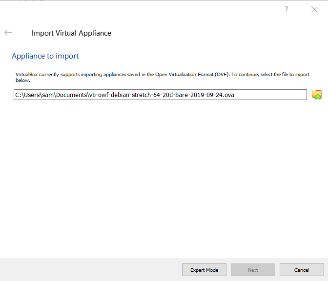
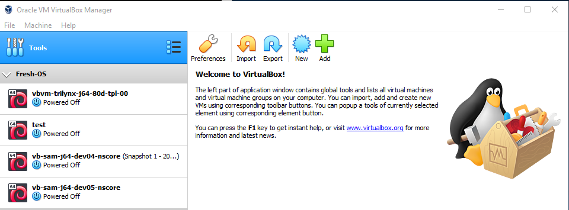

# VirtualBox / Windows 10 Host / Import Linux Debian Jessie VM Appliance

A VM appliance file (e.g., with `ova` or other supported extension) can be imported into a VirtualBox host computer
using the ***VirtualBox Manager***.
This is useful to enable a virtual machine from a standard distribution.
For example, a basic virtual box appliance VM can be created for a target operating system.
The appliance can then be used to configure VMs for the development and production environments,
each of which will install specific software into the VMs created from the appliance.

To import a VM appliance, first download or otherwise copy the VM appliance file (`ova`)
onto the host operating system computer.

Start the ***VirtualBox Manager*** software and select the ***Tools*** at the top of the window.
Start the import process by selecting the ***Import*** tool.
Use the file selector to pick an `ova` file, for example as shown below.
**Need to update the image to use longer name.**

**

**

**

Import Debian Jessie Virtual Machine (<a href="../images/import-debian-jessie1.png">see full-size image</a>)

**

Press ***Next*** to start the import.
The following shows the initial values for the VM, consistent with the appliance that was imported.

**

**

**

Import Debian Jessie Virtual Machine - Appliance Settings (from File) (<a href="../images/import-debian-jessie2.png">see full-size image</a>)

**

The values can be edited.  For example, change the initial values to e more specific:

* ***Name*** - it is recommended that this match the hostname that will be set for the machine;
therefore, specify to ensure that the VM will have a unique identifier on the network.
For example change the name from general `vb-orgname-debian-jessie-64-20d-bare` to
more specific `vb-user-j64-20d-prod-dev1`, where `prod` indicates the product and
`dev1` indicates a developer machine.

* ***Product***, etc. - specify values to describe the VM

* ***Storage Controller (SATA) / Virtual Disk Image*** - will default but typically will change the name to match the VM name

* ***Base Folder*** - generally don't change, but may need to use a drive other than system drive to use a large disk
The default location for VMs will match the value that was previously set for VirtualBox.

* ***Primary Group*** - select an appropriate group from choices, which are taken from the main ***VirtualBox Manager*** groups.

**

**

**

Import Debian Jessie Virtual Machine - Appliance Settings (after Editing) (<a href="../images/import-debian-jessie3.png">see full-size image</a>)

**

Press ***Import*** to start the import.
A dialog similar to the following will be shown to acknowledge the license for the VM contents,
if a license was specified.

**

**

**

Import Debian Jessie Virtual Machine - License (<a href="../images/import-debian-jessie4-license.png">see full-size image</a>)

**

Press ***Agree*** to agree and continue the import.
The following progress indicator will be shown.

**

**

**

Import Debian Jessie Virtual Machine - Progress (<a href="../images/import-debian-jessie5-progress.png">see full-size image</a>)

**

Once the import is complete, the VM will be listed in the ***VirtualBox Manager*** using the name that was specified,
as shown below.

**

**

**

Import Debian Jessie Virtual Machine - Complete (<a href="../images/import-debian-jessie6-complete.png">see full-size image</a>)

**

The VM can then be started.  Additional software can be installed as usual, users can be added, etc.
See [Virtual Machine Configuration](../../vm-config/linux-debian/config-debian.md).
