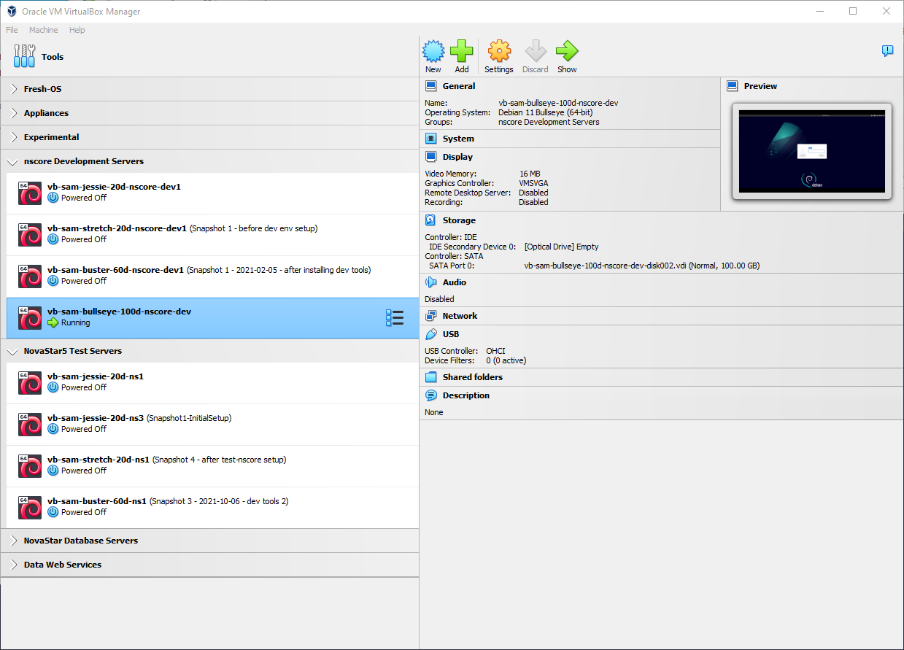

# VirtualBox / Import Appliance / Overview #

*   [Introduction](#introduction)
*   [***VirtualBox Manager*** Groups](#virtualbox-manager-groups)

---------------

## Introduction ##

Virtual machines that have been previously created, configured,
and exported as "appliances" can be imported to create a new virtual machine (VM) instance.
This allows, for example, one team member, collaborator, or product provider
to create a well-defined environment so that others can leverage that work.

VirtualBox appliances are imported using the ***File / Import Appliance*** menu.
The following documentation has been created for illustrating how to import an appliance:

*   [Windows host importing Linux Debian Bullseye Appliance](linux-debian-bullseye/import-appliance-debian-bullseye.md)
*   [Windows host importing Linux Debian Jessie Appliance](linux-debian-jessie/import-appliance-debian-jessie.md)

## ***VirtualBox Manager*** Groups ##

Appliances that are imported into VirtualBox can be organized into groups.
It is recommended that naming conventions for groups are decided before importing appliances
because it can be confusing to rename and move later.
However, creating an empty group ahead of time does not seem to be an option in ***VirtualBox Manager***.
Instead, groups are created by selecting multiple VMs and then creating a group using the right-click popup menu.
Therefore, have a plan for how VMs should be grouped,
but using groups may need to wait until two or more VMs are defined.

See the following:

*   [VirtualBox 6 Using VM Groups](https://docs.oracle.com/en/virtualization/virtualbox/6.0/user/gui-vmgroups.html)

The following example shows several groups for various products and development stages (e.g., development and testing).
Defining VMs for different Linux distributions will result in multiple VMs that can logically be organized into groups.

**

**

**

*VirtualBox Manager* Groups (<a href="../virtualbox-manager.png">see full-size image</a>)

**
