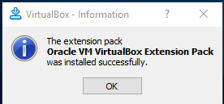
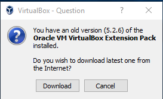
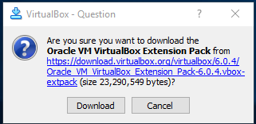
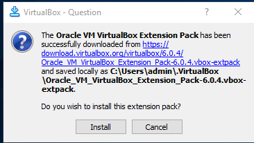
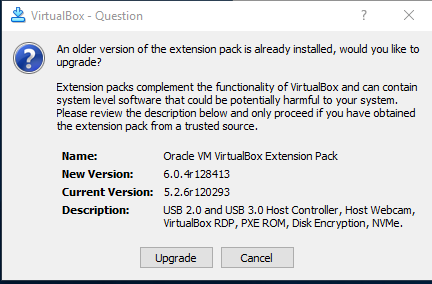
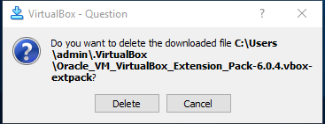

# Virtural Box / Windows 10 Host / Install Extension Pack

The Windows 10 host extension pack contains additional software to optimize integration
with host hardware such as USB.  It is generally a good idea to install the extension pack.
The following are installation instructions.

* [Manually Install Extension Pack](#manually-install-extension-pack)
* [Update Existing Extension Pack Installation](#update-existing-extension-pack-installation) - typically
will be prompted for this case when main VirtualBox software is installed

------------------

## Manually Install Extension Pack ##

To install the extension pack manually, first download the extension pack from the
[Download VirtualBox](https://www.virtualbox.org/wiki/Downloads) website.
The extension pack is clearly indicated.
The download file will have a name similar to `Oracle_VM_VirtualBox_Extension_Pack-6.0.4.vbox-extpack`.

The installer needs to be run with administrator privileges but it may not be obvious whether this
is the case because the installer is run from within the ***VirtualBox Manager***
(with no virtual machines listed).
On Windows 10, double-clicking on the file to run the installer.

If the extension pack is already installed, a prompt will ask whether to reinstall.

A prompt may be shown to accept one or more licenses.  Press ***I Agree***.

If an error is shown, it may be that the installer was not run as an administrator.
If right-clicking on the installer shows the ***Run as Administrator*** menu, use it.
Otherwise, run the Windows command prompt as administrator, change to the location of the installer,
and run the installer on the command line.
This will run the ***VirtualBox Manager*** to install the extension pack.

The following will be shown if the extension pack installs successfully:

**

**

**

VirtualBox Install Extension Pack Installation Success (<a href="../images/win-host-install12.png">see full-size image</a>)

**

Press ***OK***.

## Update Existing Extension Pack Installation ##

The following dialog may be shown if an older version of VirtualBox was previously installed on the computer,
in which case

**

**

**

VirtualBox Install Extension Pack (<a href="../images/win-host-install8.png">see full-size image</a>)

**

Press ***Download*** to download the compatible extension pack.
The following confirmation dialog will be shown.

**

**

**

VirtualBox Install Extension Pack Download Confirmation (<a href="../images/win-host-install9.png">see full-size image</a>)

**

Press ***Download*** to download the compatible extension pack.
The following dialog will be shown to confirm the extension pack installation:

**

**

**

VirtualBox Install Extension Pack Installation Confirmation (<a href="../images/win-host-install10.png">see full-size image</a>)

**

Press ***Install*** to install the extension pack.
A final confirmation may be shown as follows.

**

**

**

VirtualBox Install Extension Pack Upgrade Confirmation (<a href="../images/win-host-install11.png">see full-size image</a>)

**

Press ***Upgrade*** to upgrade the extension pack.
A VirtualBox license will be shown.  Press ***I Agree*** to continue.
The following will be shown if the extension pack installs successfully:

**

**

**

VirtualBox Install Extension Pack Installation Success (<a href="../images/win-host-install12.png">see full-size image</a>)

**

Press ***OK*** to continue.  The following dialog will be show.

**

**

**

VirtualBox Delete Extension Pack Download File Confirmation (<a href="../images/win-host-install13.png">see full-size image</a>)

**

Press ***Delete*** to delete the file and continue.
