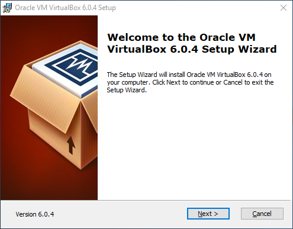
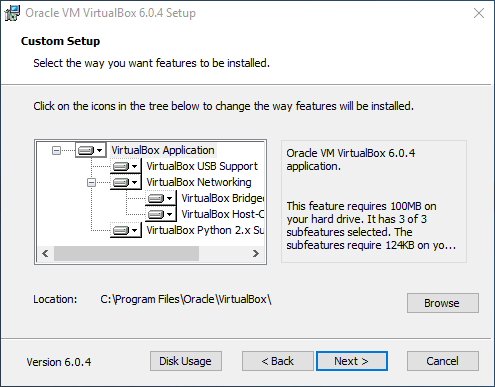
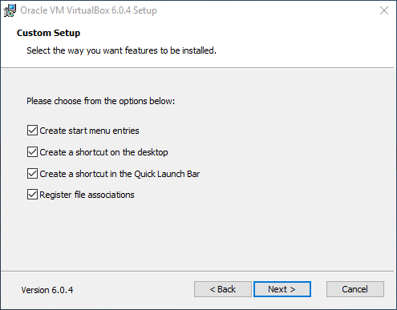
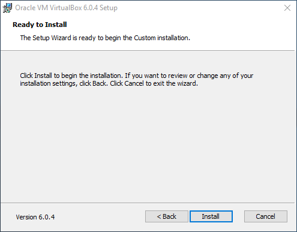
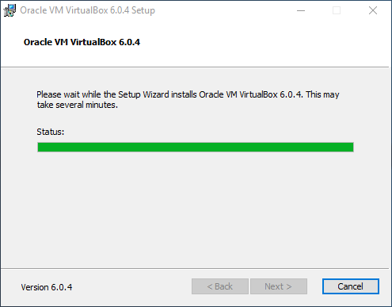
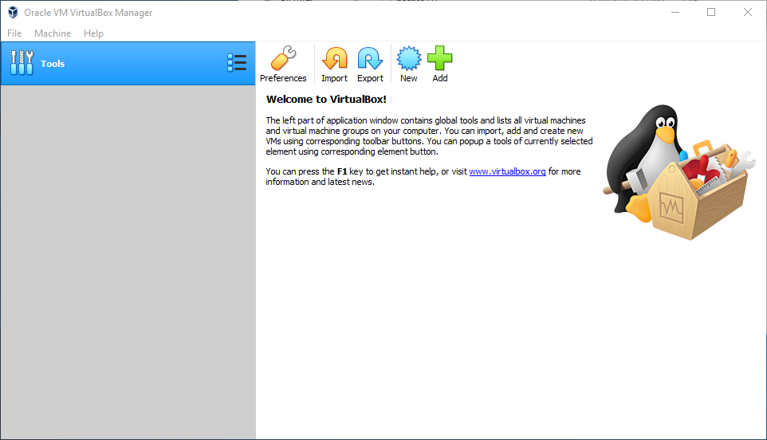

# VirtualBox / Windows 10 Host / Main Install #

This page describes how to install VirtualBox software on a Windows 10 operating system host computer.
VirtualBox software needs to be installed on the host (original) computer in order to
run virtual machines that use a different operating system.

The following documentation is for VirtualBox 6.0.4, but other versions will be similar.
It is generally wise to install the most recent version.
The installer will update the software if already installed.

Download the VirtualBox installer from the [VirtualBox Downloads](https://www.virtualbox.org/wiki/Downloads) page.
Choose the "Windows hosts" installer, which will result in a local file named `VirtualBox-6.0.4-128413-Win.exe` or similar.
Once downloaded, run the installer program as administrator.

**

**

**

VirtualBox Installer Introduction (<a href="../images/win-host-install1.png">see full-size image</a>)

**

Press ***Next >*** to continue the installation.
The following step allows selecting which components are to be installed.

**

**

**

VirtualBox Installer Custom Setup (<a href="../images/win-host-install2.png">see full-size image</a>)

**

Accept the defaults without changes and press ***Next >*** to continue.
The following step configures menus and shortcuts to start the software.

**

**

**

VirtualBox Installer Custom Setup (<a href="../images/win-host-install3.png">see full-size image</a>)

**

Accept the defaults without changes and press ***Next >*** to continue.
The following warning indicates that network operations may be temporarily interrupted.

**

**

**

VirtualBox Installer Network Interface Warning (<a href="../images/win-host-install4.png">see full-size image</a>)

**

Acknowledge the warning by pressing ***Yes*** to continue.
The following confirms continuing with the installation.

**

**

**

VirtualBox Installer Ready to Install (<a href="../images/win-host-install5.png">see full-size image</a>)

**

The installer provides an opportunity to review installations settings.  Press ***Install*** to continue.
The following shows installation progress.

**

**

**

VirtualBox Installer Progress (<a href="../images/win-host-install6.png">see full-size image</a>)

**

The following is shown when the installation is complete.

**

**

**

VirtualBox Installation Complete (<a href="../images/win-host-install7.png">see full-size image</a>)

**

Press ***Finish*** to start VirtualBox.

The following dialog may be shown if an older version of VirtualBox was previously installed on the
computer.

**

**

**

VirtualBox Install Extension Pack (<a href="../images/win-host-install8.png">see full-size image</a>)

**

If the above is shown follow the [Windows 10 Host / Install Extension Pack](install-win-host-extension-pack.md) instructions.

The ***VirtualBox Manager*** will then be shown similar to the following:

**

**

**

VirtualBox Manager Initial View (<a href="../images/win-host-install14.png">see full-size image</a>)

**

If the extension pack installation was not prompted for (as shown above), then the extension pack can be installed before continuing.
**Note that the extension pack is free for evaluation and personal use but is not free for commercial use.**
See the [Extension pack License](https://www.virtualbox.org/wiki/VirtualBox_PUEL).
To install, see the [Windows 10 Host / Install Extension Pack](install-win-host-extension-pack.md) instructions.

Other sections of this documentation explain how to use the ***VirtualBox Manager*** to define and import virtual machines.

**Make sure to exit the ***VirtualBox Manager*** when run as administrator and restart as a normal user.
Otherwise, when creating new virtual machines file locations may be for an administrator account and not the user
for which the VM is being created.**
