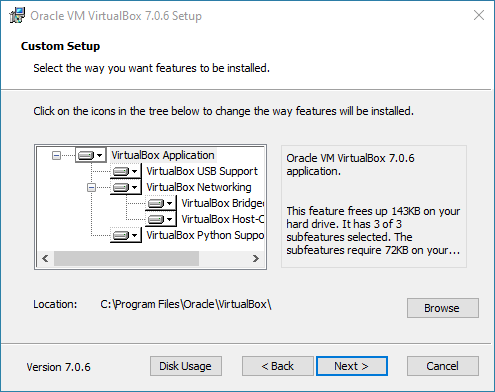

# VirtualBox / Windows 10 Host / Main Install #

This page describes how to install VirtualBox software on a Windows 10 operating system host computer.
Windows 11 should be similar but is not specifically documented here.

*   [Introduction](#introduction)
*   [VirtualBox 7](#virtualbox-7)
    +   [Download the VirtualBox 7 Software](#download-the-virtualbox-7-software)
    +   [Run the VirtualBox 7 Installer](#run-the-virtualbox-7-installer)
    +   [Install the VirtualBox 7 Extension Pack](#install-the-virtualbox-7-extension-pack)
    +   [VirtualBox 7 ***VirtualBox Manager***](#virtualbox-7-virtualbox-manager)
*   [VirtualBox 6](#virtualbox-6)
    +   [Download the VirtualBox 6 Software](#download-the-virtualbox-6-software)
    +   [Run the VirtualBox 6 Installer](#run-the-virtualbox-6-installer)
    +   [Install the VirtualBox 6 Extension Pack](#install-the-virtualbox-6-extension-pack)
    +   [VirtualBox 6 ***VirtualBox Manager***](#virtualbox-6-virtualbox-manager)
*   [Run the ***VirtualBox Manager*** as a Normal User](#run-the-virtualbox-manager-as-a-normal-user)

If updating the software, see the following:

*   [Updating the VirtualBox Software](#updating-the-virtualbox-software)

----

## Introduction ##

A single version of VirtuaBox software should be installed on a Windows computer and it is
typically best to install the latest version.
VirtualBox software is updated frequently but it is generally not necessary to keep up to date with the latest.
VirtualBox software updates can be installed when convenient.

The most important thing is to coordinate virtual machine environments between
team members and for development and deployed environments
because the virtual machines contain many software programs that must be compatible.

Documentation for different VirtualBox versions is included below.
However, the differences tend to be minor.
The VirtualBox installer will update an old version to the installer version.

See also an explanation of [VirtualBox Windows Host File Locations](file-locations.md).

## VirtualBox 7 ##

The following documentation uses VirtualBox 7.0.6 as an example.
Installing the most recent VirtualBox software is recommended.

### Download the VirtualBox 7 Software ###

VirtualBox software needs to be installed on the host (original) computer in order to
run virtual machines that use a different operating system.

The following documentation is for VirtualBox 7.0.6, but other versions will be similar.
It is generally wise to install the most recent version.
The installer will update the software if an older version of VirtualBox is already installed.

Download the VirtualBox installer from the [VirtualBox Downloads](https://www.virtualbox.org/wiki/Downloads) page.
Choose the "Windows hosts" installer, which will result in a local file named `VirtualBox-7.0.6-155176-Win.exe` or similar.

### Run the VirtualBox 7 Installer ###

Once the VirtualBox installer has been downloaded, run the installer program as administrator.

If the following warning is shown,
install the latest [Microsoft Visual C++ Redistributable software](https://learn.microsoft.com/en-us/cpp/windows/latest-supported-vc-redist?view=msvc-170).

**

**

**

C++ Redistributable Error (<a href="../images7/win-host-install0-cpp-redistributable.png">see full-size image</a>)

**

Continue with the VirtualBox installation.

**

**

**

VirtualBox Installer Introduction (<a href="../images7/win-host-install1.png">see full-size image</a>)

**

Press ***Next >*** to continue the installation.
The following step allows selecting which components are to be installed.

**

**

**

VirtualBox Installer Custom Setup (<a href="../images7/win-host-install2.png">see full-size image</a>)

**

Accept the defaults without changes and press ***Next >*** to continue.
The following warning indicates that network operations may be temporarily interrupted.

**

**

**

VirtualBox Installer Network Interface Warning (<a href="../images7/win-host-install3.png">see full-size image</a>)

**

Acknowledge the warning by pressing ***Yes*** to continue.

The following may be shown if Python packages are missing (they can be installed later if needed).

**

**

**

VirtualBox Installer Missing Python Dependencies (<a href="../images7/win-host-install4.png">see full-size image</a>)

**

The installer provides an opportunity to review installations settings.  Press ***Yes*** to continue.

The following confirms continuing with the installation.

**

**

**

VirtualBox Installer Ready to Install (<a href="../images7/win-host-install5.png">see full-size image</a>)

**

The installer provides an opportunity to review installations settings.  Press ***Install*** to continue.
The following shows installation progress.

**

**

**

VirtualBox Installer Progress (<a href="../images7/win-host-install6.png">see full-size image</a>)

**

The following is shown when the installation is complete.

**

**

**

VirtualBox Installation Complete (<a href="../images7/win-host-install7.png">see full-size image</a>)

**

Press ***Finish*** to start VirtualBox.

### Install the VirtualBox 7 Extension Pack ###

The following dialog may be shown if an older version of VirtualBox was previously installed on the
computer.

**

**

**

VirtualBox Install Extension Pack (<a href="../images7/win-host-install8.png">see full-size image</a>)

**

If the above is shown follow the [Windows 10 Host / Install Extension Pack](install-win-host-extension-pack.md) instructions.

### VirtualBox 7 ***VirtualBox Manager*** ###

The ***VirtualBox Manager*** will then be shown similar to the following:

**

**

**

VirtualBox Manager Initial View (<a href="../images7/win-host-install14.png">see full-size image</a>)

**

If the extension pack installation was not prompted for (as shown above), then the extension pack can be installed before continuing.
**Note that the extension pack is free for evaluation and personal use but is not free for commercial use.**
The extension pack provides additional integration, such as for USB devices, and is not required to effectively use VirtualBox.
For example, a folder can be shared between the host and guest machines to allow files to be copied to the Windows computer,
and USB devices can be used on the Windows host.

See the [Extension pack License](https://www.virtualbox.org/wiki/VirtualBox_PUEL).
To install, see the [Windows 10 Host / Install Extension Pack](install-win-host-extension-pack.md) instructions.

## VirtualBox 6 ##

The following older documentation is retained for VirtualBox 6.
Installing the most recent VirtualBox software is recommended.

### Download the VirtualBox 6 Software ###

VirtualBox software needs to be installed on the host (original) computer in order to
run virtual machines that use a different operating system.

The following documentation is for VirtualBox 6.0.4, but other versions will be similar.
It is generally wise to install the most recent version.
The installer will update the software if an older version of VirtualBox is already installed.

Download the VirtualBox installer from the [VirtualBox Downloads](https://www.virtualbox.org/wiki/Downloads) page.
Choose the "Windows hosts" installer, which will result in a local file named `VirtualBox-6.0.4-128413-Win.exe` or similar.

### Run the VirtualBox 6 Installer ###

Once the VirtualBox installer has been downloaded, run the installer program as administrator.

**

**

**

VirtualBox Installer Introduction (<a href="../images6/win-host-install1.png">see full-size image</a>)

**

Press ***Next >*** to continue the installation.
The following step allows selecting which components are to be installed.

**

**

**

VirtualBox Installer Custom Setup (<a href="../images6/win-host-install2.png">see full-size image</a>)

**

Accept the defaults without changes and press ***Next >*** to continue.
The following step configures menus and shortcuts to start the software.

**

**

**

VirtualBox Installer Custom Setup Install Options (<a href="../images6/win-host-install3.png">see full-size image</a>)

**

Accept the defaults without changes and press ***Next >*** to continue.
The following warning indicates that network operations may be temporarily interrupted.

**

**

**

VirtualBox Installer Network Interface Warning (<a href="../images6/win-host-install4.png">see full-size image</a>)

**

Acknowledge the warning by pressing ***Yes*** to continue.
The following confirms continuing with the installation.

**

**

**

VirtualBox Installer Ready to Install (<a href="../images6/win-host-install5.png">see full-size image</a>)

**

The installer provides an opportunity to review installations settings.  Press ***Install*** to continue.
The following shows installation progress.

**

**

**

VirtualBox Installer Progress (<a href="../images6/win-host-install6.png">see full-size image</a>)

**

The following is shown when the installation is complete.

**

**

**

VirtualBox Installation Complete (<a href="../images6/win-host-install7.png">see full-size image</a>)

**

Press ***Finish*** to start VirtualBox.

### Install the VirtualBox 6 Extension Pack ###

The following dialog may be shown if an older version of VirtualBox was previously installed on the
computer.

**

**

**

VirtualBox Install Extension Pack (<a href="../images6/win-host-install8.png">see full-size image</a>)

**

If the above is shown follow the [Windows 10 Host / Install Extension Pack](install-win-host-extension-pack.md) instructions.

### VirtualBox 6 ***VirtualBox Manager*** ##

The ***VirtualBox Manager*** will then be shown similar to the following:

**

**

**

VirtualBox Manager Initial View (<a href="../images6/win-host-install14.png">see full-size image</a>)

**

If the extension pack installation was not prompted for (as shown above), then the extension pack can be installed before continuing.
**Note that the extension pack is free for evaluation and personal use but is not free for commercial use.**
The extension pack provides additional integration, such as for USB devices, and is not required to effectively use VirtualBox.
For example, a folder can be shared between the host and guest machines to allow files to be copied to the Windows computer,
and USB devices can be used on the Windows host.

See the [Extension pack License](https://www.virtualbox.org/wiki/VirtualBox_PUEL).
To install, see the [Windows 10 Host / Install Extension Pack](install-win-host-extension-pack.md) instructions.

## Run the ***VirtualBox Manager*** as a Normal User ##

Other sections of this documentation explain how to use the ***VirtualBox Manager*** to define and import virtual machines.

**Make sure to exit the *VirtualBox Manager* when run as administrator and restart as a normal user.
Otherwise, when creating new virtual machines file locations may be for an administrator account and not the user
for which the VM is being created.**

## Updating the VirtualBox Software ##

This section describes how to update the VirtualBox software.
The current version of VirtualBox can be shown using the ***Help / About VirtualBox*** menu.
For this example, the starting version is `6.1.2 r135662 (Qt5.6.2)` and the update is to 7.0.6.

The ***VirtualBox Manager*** software will often show a message similar to the following:

**

**

**

VirtualBox Manager Update Notice (<a href="../images/win-host-update1.png">see full-size image</a>)

**

To update the software:

1.  Click on the download link URL or visit [`https://www.virtualbox.org/wiki/Downloads`](https://www.virtualbox.org/wiki/Downloads).

2.  Download and install VirtualBox as per the other sections of this documentation.
