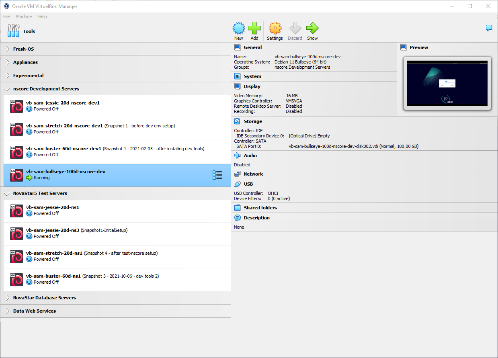

# VirtualBox / Introduction  #

*   [Virtual Machine Background](#virtual-machine-background)
*   [VirtualBox Background](#virtualbox-background)

-------

## Virtual Machine Background ##

A virtual machine provides a way to encapsulate a computer in a (mostly) self-contained environment
that allows for full functionality while being (mostly) isolated from other systems.
The "mostly" involves software integration that allows software systems to work within software systems.

In the past, running Linux on a Windows computer required a "dual boot",
meaning that the user had to select which operating system the computer would run at startup,
and then the computer would boot up in that operating system,
with dedicated resources such as hard drive space for each operating system.
This setup could be complicated, technical, and intimidating.

Modern virtual machines allow installing a virtual machine "guest" on the primary "host" computer.
This requires:

1.  The computer and host operating system must support virtualization.
    Modern operating systems typically do.
    For example, a Microsoft Windows host computer can run multiple Linux guest virtual machines.
3.  Virtualization software like VirtualBox must support creating, exporting, importing, and managing virtual machines.
    The ***VirtualBox Manager*** provides this functionality.
4.  The guest virtual machine operating systems must allow creating virtual machines,
    including licenses that allow the operating system to run.
    Linux operating systems are attractive for virtual machines because they are often free to use.
5.  Additional software may be needed to integrate the guest operating system with the host,
    like VirtualBox "guest additions".
    For example, these additions allow sharing folders and copy and paste.

Virtual machines are not the same as "containers" (e.g., [Docker](https://www.docker.com/)).
This documentation does not discuss containers.

Some languages, including as Java, .NET, and Python, use "runtime environments"
that help to encapsulate the software into a portable and self-contained environment.
These environments are sometimes also called virtual machines, such as "Java virtual machine"
or running the `java` executable (which runs a Java language program)
is referred to as a "Java virtual machine instance".
This documentation does not discuss runtime environments.

Virtual machines, containers, and runtime environments can all be used together.

See the following resources:

*   Virtual machines:
    +   ["Virtual machine" on Wikipedia](https://en.wikipedia.org/wiki/Virtual_machine)
    +   [VirtualBox website](https://www.virtualbox.org/)
*   Containers:
    +   [Amazon Web Services: "What's The Difference Between Containers and Virtual Machines?"](https://aws.amazon.com/compare/the-difference-between-containers-and-virtual-machines/)
*   Software language runtime environments:  
    +   Java: ["Java virtual machine" on Wikipedia](https://en.wikipedia.org/wiki/Java_virtual_machine)
    +   .NET: [".NET Framework" on Wikipedia](https://en.wikipedia.org/wiki/.NET_Framework)
    +   Python: [venv - Creation of virtual environments](https://docs.python.org/3/library/venv.html)

## VirtualBox Background ##

This documentation focuses on VirtualBox virtual machines.
VirtualBox is free to use and is convenient to use on Windows.
Benefits of VirtualBox include:

*   Can run full Linux environments on Windows,
    for example to do software development on a desktop virtual machine prior
    to deploying in a production virtual machine environment.
*   Can create and run multiple virtual machines for different lifecycle environments,
    for example have one virtual machine for development and another for testing in a prodution environment,
    especially when the software and configurations for each environment is complicated and different.
    Using separate virtual machines ensures that the each environment don't intermingle in unexpected ways.
*   Can create virtual machines for different operating system distributions and versions
    to allow transition over time.
    This also allows different versions of production environments to be supported over time as
    deployed systems are updated.

Using virtual machines in a thoughtful and rigorous way does require resources up front.
However, the initial time investment can result in saving time later and operational efficiency.
For example:

*   **Creating Virtual Machines:**
    +    Creating a virtual machine involves creating a "bare" operating system environment that
         contains basic system files for the operating system.
    +    This can be done once for each target operating system needed by an organization.
    +    See the [Create Guest VM](../create-guest/overview.md) documentation.
*   **Exporting Virtual Machine Appliances:**
    +    Saving virtual machine "appliances" allows other people to import and use for more specific configurations.
    +    For example, save a bare VM appliance as a starting point for other configurations
         and can save additional configurations to save time starting up new machines.
    +    See the [Export Appliance](../export-appliance/overview.md) documentation
*   **Importing Virtual Machine Appliances:**
    +    Virtual machine appliances that have been previously created can be imported as new virtual machines.
    +    For example, import a bare VM appliance as a starting point for a development,
         test, or production environment.
    +    See the [Import Appliance](../import-appliance/overview.md) documentation

The ***VirtualBox Manager*** software provides features to create, export, import, and manage virtual machines.
For example, the following image shows multiple virtual machines organized into groups by purpose,
with each virtual machine having a verbose name to indicate its purpose,
basic characteristics, and version.

**

**

**

*VirtualBox Manager* (<a href="../virtualbox-manager.png">see full-size image</a>)

**
