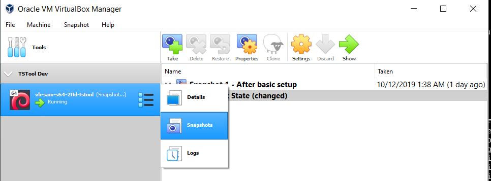
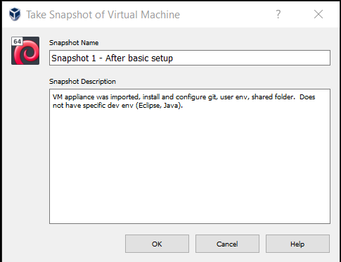
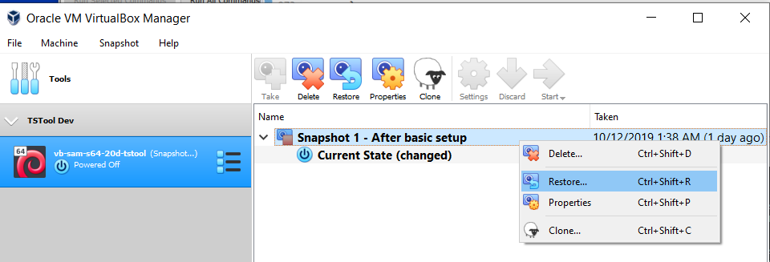
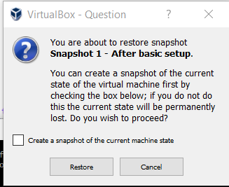

# VirtualBox / Snapshots #

* [Overview](#overview)
* [Saving a Snapshot](#saving-a-snapshot)
* [Restoring a Snapshot](#restoring-a-snapshot)

------------------

## Overview ##

A VM snapshot is a saved representation of the VM state,
which allows the VM to be restored to that state.
This is particularly useful when the work done on a VM after a point can be discarded.
For example, when testing a software installer prior to software release,
a VM may be restored to an initial state and then the installer is run and tested.

## Saving a Snapshot ##

To save a snapshot, it is generally best to stop the VM so that files are not actively being modified.
Then click on the menu on the right side of the VM name in ***VirtualBox Manager*** as shown below and
select ***Snapshots***.

**

**

**

Save (Take) a Snapshot (<a href="../images/save-snapshot1.png">see full-size image</a>)

**

Next, provide a snapshort name and description, similar to the following.

**

**

**

Snapshot Information (<a href="../images/save-snapshot2.png">see full-size image</a>)

**

The snapshot will then be available to restore.
Note that snapshots consist of a delta between VM states, not a full save.
The VirtualBox software maintains the snapshots.

## Restoring a Snapshot ##

A snapshot can be restored by first opening the snapshots tool (***Snapshots*** from
menu to the right of the VM name).
Then use the ***Restore*** tool, or right-click on the snapshot to restore and
select the ***Restore...*** menu item, as shown below.

**

**

**

Restore a Snapshot (<a href="../images/restore-snapshot1.png">see full-size image</a>)

**

The following prompt will confirm the restore and also give the option of
creating a snapshot of the current machine state.
If the current state is important, save a snapshot.
Otherwise, unclick the ***Create a snapshot of the current machine state*** choice,
as shown in the following example.
It is also important to commit work to Git or other repository and push to the cloud
so that current files are saved.
Press ***Restore*** to restore the snapshot to replace the previous VM state.
Any work done after the snapshot will need to be redone.

**

**

**

Restore a Snapshot - Confirmation (<a href="../images/restore-snapshot2.png">see full-size image</a>)

**

The VM can then be started by selecting ***Current State*** in snapshots and the ***Start*** tool/menu.
