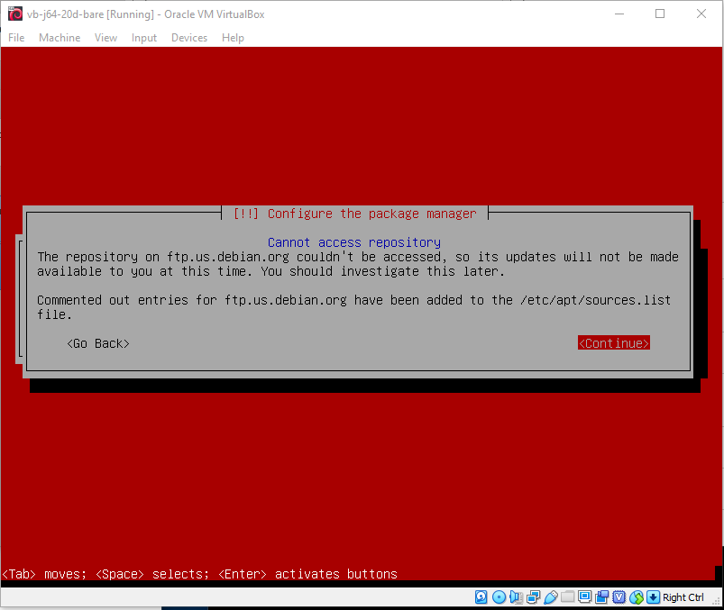

# VirtualBox / Troubleshooting #

The following are useful resources for troubleshooting.

*   [Debian Linux Guest](#debian-linux-guest)
    +   [Debian Linux: General](#debian-linux-general)
        -   [Issue: Mouse does not move beyond the VM window boundary](#issue-mouse-does-not-move-beyond-the-vm-window-boundary)
        -   [Issue: For Debian guest VMs, the display shows black after some period of time and does not respond to mouse or keyboard input](#issue-for-debian-guest-vms-the-display-shows-black-after-some-period-of-time-and-does-not-respond-to-mouse-or-keyboard-input)
        -   [Issue: The VM becomes unresponsive to keyboard input](#issue-the-vm-becomes-unresponsive-to-keyboard-input)
        -   [Issue: For Debian guest VM, increasing the window size results in a black screen](#issue-for-debian-guest-vm-increasing-the-window-size-results-in-a-black-screen)
        -   [Issue: Unable to copy and paste between the guest VM and other computers](#issue-unable-to-copy-and-paste-between-the-guest-vm-and-other-computers)
    +   [Debian Linux: Installation](#debian-linux-installation)
        -   [Issue: Installing the Extension Pack shows error `Cannot install extension pack` (Windows 10)](#issue-installing-the-extension-pack-shows-error-cannot-install-extension-pack-windows-10)
        -   [Issue: While installing the operating system software, an error is shown about not being able access repository (see image below)](#issue-while-installing-the-operating-system-software-an-error-is-shown-about-not-being-able-access-repository)
        -   [Issue: After installing guest additions, screen is black after startup](#issue-after-installing-guest-additions-screen-is-black-after-startup)
    +   [Debian Linux: Network](#debian-linux-network)
        -   [Issue: Running the VM appliance says could not start the machine because a physical network device is missing](#issue-running-the-vm-appliance-says-could-not-start-the-machine-because-a-physical-network-device-is-missing)
        -   [Issue: Error communicating on the network](#issue-error-communicating-on-the-network)

---

## Debian Linux Guest ##

The following troubleshooting issues have occurred on a Debian Linux guest.

### Debian Linux: General ###

#### Issue: Mouse does not move beyond the VM window boundary ####

*   **Possible Solution**:
    +   The mouse is captured by the guest VM.  Use the ***Right-ctrl*** key to toggle this behavior.
        Fix by installing and configuring guest additions.

#### Issue:  For Debian guest VMs, the display shows black after some period of time and does not respond to mouse or keyboard input ####

*   **Symptoms**:
    +   Entire Linux desktop displays in black and is unresponsive to keyboard or mouse input.
    +   VirtualBox menus in menu bar for the VM are functional.
    +   Can `ssh` into the VM.
+   **Possible Solution**:
    +   Position the mouse on the black screen (even though it cannot be seen) and
        use the keyboard to enter ***Ctrl-Alt-F1*** at the same time.
        This is used to wake up the virtual desktop.
    +   Installing a screen saver might help, for example `xscreensaver`.

#### Issue: The VM becomes unresponsive to keyboard input ####

*   **Symptoms**:
    +   Has been seen on Debian Jessie.
    +   The keyboard becomes unresponsive.
    +   In a terminal window it is necessary to hold down a key for a period of time in order for the character to appear.
    +   The issue is specific to a single VM - other VMs behave as usual.
+   **Information**:
    +   Holding a key down, for example in a terminal window, causes the VM to go into "slow keys" mode.
        Apparently this is to allow people with disabilities to use keyboards
        without multiple characers displaying due to slow keystrokes.
        This can be accidentally triggered, for example when using `vim` editor and holding a key down
        for awhile, or becoming distracted and holding a key down.
+   **Possible Solution**:
    +   To fix, change mouse focus to the VM for a terminal window and hold the ***Shift*** key down for several seconds
        until ***Slow keys are disabled*** popup shows.
        Apparently the threshold for toggling the setting is a time that would not normally occur
        and can therefore clearly be used to indicate the toggle.
*   **Work-around** (the above solution is recommended rather than work-around):
    +   Right-click on the ***USB Settings*** icon at the bottom of the VM window and select the keyboard,
        for example Microsoft Natural Ergonomic Keyboard 4000.
        This seems to assign the keyboard to the VM and it won't be recognized by other VMs.
    +   Reboot the VM.

#### Issue: For Debian guest VM, increasing the window size results in a black screen ####

*   **Symptoms**:
    +   Resizing the VM window results in a black window.
    +   The behavior may occur when scroll bars are shown.
+   **Possible Solution**:
    +   Increase the VM's video memory (e.g., to 128 MB) and turn on ***Enable 3D Accelertion*** as shown below.

**

**

**

Set the Video Display Memory (<a href="../images/display-video-memory.png">see full-size image</a>)

**

#### Issue: Unable to copy and paste between the guest VM and other computers ####

*   **Symptoms**:
    +   Copy and paste between guest VM and host or other VMs does not work
+   **Possible Solution**:
    +   Make sure that guest additions are installed.
    +   Set the VM ***Devices / Shared Clipboard*** to ***Bidirectional***.

### Debian Linux: Installation ###

#### Issue: Installing the Extension Pack shows error `Cannot install extension pack` (Windows 10) ####

*   **Background**:  Installing the extension pack is not usually needed and is only free for personal and evaluation use.
*   **Possible Solution**: This may be because the attempt to install the extension pack did not use an
    account with administrator priveleges.
    Try installing by running the installer from a command prompt window that is run as administrator.

#### Issue:  While installing the operating system software, an error is shown about not being able access repository ####

**

**

**

Debian Download Error (<a href="../images/error-debian-site.png">see full-size image</a>)

**

*   **Background**:
    +   This is usually due to changes on servers, such as phasing out a mirror for old distributions.
    +   It could be due to a temporary internet outage.
*   **Possible Solutions**:
    +   Try a different mirror for downloads.
    +   The operating system may have moved from active/supported to a different state, such as archive.
        This requires changing the `apt` `sources.list` file so that software is retrieved from the appropriate server.
        For example, for Debian, older versions such as jessie must use archive mirror.

#### Issue: After installing guest additions, screen is black after startup ####

*   **Possible Solution**:
    +   If using Debian Jessie and Virtual Box 6, try using the ***Display / Graphics Controller*** setting
        of `VBoxVGA`.
    +   Enabling ***3D Acceleration*** in ***Display*** settings can also cause issues so try disabling.

### Debian Linux: Network ###

#### Issue: Running the VM appliance says could not start the machine because a physical network device is missing ####

**

**

*   **Possible Solution**:
    +   This may be because a VM appliance was imported and available hardware on the
        new computer is different than the one that created the appliance.
        Clicking on ***Change Network Settings*** shows the following.
        Press ***OK*** to save and all seems OK.

    **

    
    
**

#### Issue:  Error communicating on the network ####

The VM may exhibit issues such as not being able to download software using `apt`.
The VM may show other than the normal network address such as `127.0.0.1`.

*   **Possible Solution**:
    +   It may be necessary to turn off IPv6 on the Windows host machine using
        ***Settings / Network & Internet / Change adapter options***.
        Right-click on ***Wi-Fi*** and open the ***Properties*** and uncheck
        ***Internet Protocol Version 6 (TCP/IpV6)*** as shown below.
        **Note that disabling IP 6 may have other impacts on the computer but IP 4 is often the default.**

        **

        
        
**
