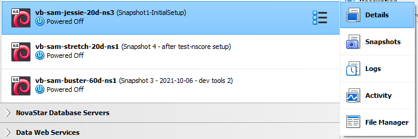

# VirtualBox / VM Settings / Overview #

*   [Introduction](#introduction)
*   [General](#general)
*   [System](#system)
*   [Display](#display)
*   [Storage](#storage)
*   [Audio](#audio)
*   [Network](#network)
*   [Serial Ports](#serial-ports)
*   [USB](#usb)
*   [Shared folders](shared-folders/shared-folders.md)
*   [User Interface](#user-interface)

----

## Introduction ##

Virtual machine (VM) settings control the characteristics and behavior of the VM.
Settings can be changed at any time.
However, some settings such as shared folders,
require that the VM is properly configured first.
For example, user(s) must be created on the VM in order to share folders.

Virtual machine settings can be accessed by clicking on the icon to the right of the virtual machine name
in the ***VirtualBox Manager*** and then selecting ***Details***.

**

**

**

Virtual machine popup menu (<a href="../vm-popup-menu.png">see the full-size image</a>)

**

The settings details will be shown on the right side of the ***VituralBox Manager***.
Then click on the headings, for example ***General*** to expand the settings.

Some settings can be changed while a VM is running but others may require shutting down the VM.

## General ##

General settings provide general information including the operating system, VM name, and group.

*   It is recommended that the VM name and the Linux host name are the same (or very similar) to avoid confusion,
    especially if many VMs are used.

## System ##

System settings include the number of CPUs, memory, and other processor configuration.
These settings can be optimized based on the VM performance level that is needed.
Although multiple VMs can run concurrently,
the number and size are limited by the host computer's processor and memory.
If a large VM is run, then fewer VMs can be run at the same time.
More memory can be installed in the host computer to alleviate resource issues.

## Display ##

Display settings generally don't need to be changed but may require experimentation.
See also the [Troubleshooting](../troubleshooting/troubleshooting.md) documentation
for information about some irritating behaviors such as VM black screen.

## Storage ##

Storage is configured when a VM is created or imported.
It is often best to use dynamic storage so that the VM does not use dedicated storage on the host machine.
Using dynamic resizing up to a limit allows the storage use to grow over time.
Worst case, if dynamic storage requirements become large on a VM,
reimport a bare VM appliance, configure/copy what is needed, and delete the bloated VM.

## Audio ##

Audio features may or may not work as intended because host computer components are used.
Experiment to evaluate what works or just rely on running some software on the host computer.

## Network ##

Using a "Bridged Adapter" works well for allowing the VM to access the network.
Technical considerations include:

*   **Local network addressing**:
    +   The VM will probably be visible on the local network so a unique MAC address,
        host name, and IP address are needed.
        If problems arise with networking, make sure that multiple VMs are not using the same addresses.
    +   A local router that does dynamic addressing will usually remember the VM between sessions.
    +   Many VMs on a local network will eventually use the 255 addresses in the 4th part of an IP4 address
        and configuration of a larger local network may be required.
    +   VMs and the host computer can see each other.
        For eample, a web or database server running on a guest VM can be accessed by its local IP address or host name.
*   **Unique VM host name**:
    +   If the VM is visible on a larger local network (not just a single computer),
        make sure to name the VM uniquely so that it does not conflict with other users' VMs.
        For example use the person's name or initials in the host name
        in addition to other identifying information such as the Linux distribution.
*   **IP4 and IP6**:
    +   Trying to use IP6 may cause issues.
        IP4 is sufficient for most work.

## Serial Ports ##

Need to add information.

## USB ##

Need to add information.  Does this require VirtualBox extensions, possibly with a licensing cost?

## Shared Folders ###

Shared folders are useful for exchanging files between host and guest machines.
For example, copy to/from a common shared folder rather than having to use secure copy (`scp`),
configure Samba, or some other approach.

See [Shared Folders](shared-folders/shared-folders.md) documentation for details on setting up shared folders.

## User Interface ##

User interface settings include basic settings for host and guest interoperability including copy and paste,
drag and drop, etc.

A description can also be set to describe the VM.
This, in addition to snapshot descriptions, can help understand the VM contents and avoid confusion.
