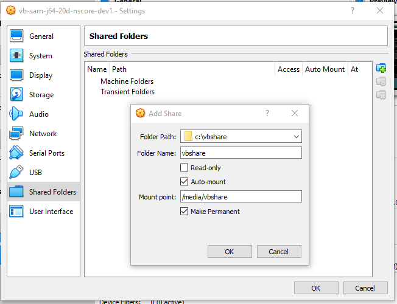
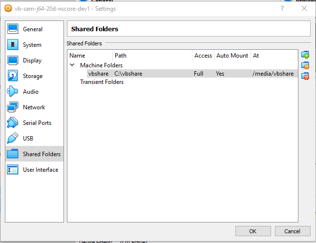

# VirtualBox / Shared Folders #

This documentation explains how to share folders between Windows host and Linux guest operating system.
This allows files to be copied back and forth using a shared folder.

The following documentation was written for Windows 10 and VirtualBox 6.0.4.
Windows 11 and newer VitualBox is similar.

*   [Create a Shared Folder on the Windows Host](#create-a-shared-folder-on-the-windows-host)
*   [Add Linux User to `vboxsf` Group](#add-linux-user-to-vboxsf-group)
*   [Add Shared Folder in the ***VirtualBox*** Manager](#add-shared-folder-in-the-virtualbox-manager)

----

## Create a Shared Folder on the Windows Host ##

This step only needs to be completed when initially sharing a Windows folder.
Multiple Linux VMs can access the same shared Windows folder(s).

Using shared folders requires that the VirtualBox guest additions are installed.
Guest additions can be installed when creating a VM or after importing a VM appliance.
If an appliance is imported, it may already have had guest additions installed.
For example, see the
[Debian Jessie Install Guest Additions](../../create-guest/linux-debian-jessie/create-guest-debian-jessie.md#install-guest-additions) documentation.

To enable sharing a folder, do the following on the host machine:

1.  Create a convenient folder that can be used for shared files,
    for example `C:\vbshare` (or `D:\vbshare` or another drive).
2.  It is recommended to only share folders necessary to complete work on the VM,
    not entire Windows file systems.

It is not necessary to set Windows sharing properties on this folder.

Repeat for as many folders need to be shared.

## Add Linux User to `vboxsf` Group ##

Do the following on the Linux Debian guest.
The instructions have been tested on Debian jessie and later.

Make sure that the user is in the `vboxsf` group, which grants permissions to shared folders,
where `username` is the user to be configured:

```
$ sudo usermod -a -G vboxsf username
```

Then `cat /etc/group` should show the user listed in the `vboxsf` group.

## Add Shared Folder in the ***VirtualBox*** Manager ##

In ***VirtualBox Manager***, select the VM of interest and open the ***Shared Folders*** settings.
Then use the ***Add (plus)*** button on the right to add a shared folder.
For example, the following mounts a guest operating system folder `/media/vbshare`
matching the `C:\vbshare` host operating system folder, with the following settings:

*   ***Folder Path*** - the Windows host operating system folder to share (must exist, otherwise the ***OK*** button will be disabled)
*   ***Folder Name*** - repeat the folder name from above, which will be used to display the folder name in the guest operating system
    (this typically auto-fills when the folder path is provided)
*   ***Read-only***
    +   typically do not want this to be set because want to allow files to be written from either direction
    +   use read-only if Windows files need to be protected against writes
*   ***Auto-mount*** - typically want to select because want the shared folder to be configured automatically when the guest operating system starts
*   ***Mount point*** - the guest operating system folder where the shared folder will mount (will be created if it does not exist)
*   ***Make Permanent***
    +   if selected, the shared folder is a ***Machine Folders*** in the ***VirtualBox Manager / Shared Folders*** view
        and will be mounted when the VM restarts
    +   otherwise, will be listed in ***Transient Folders*** in the ***VitualBox Manager / Shared Folders*** view

**<p style="text-align: center;">

</p>**

**<p style="text-align: center;">
Configure Shared Folder (Editing) (<a href="../images/win-linux-shared-folders1.png">see full-size image</a>)
</p>**

Press ***OK*** to save the settings, which will display the shared folder as follows.

**<p style="text-align: center;">

</p>**

**<p style="text-align: center;">
Configure Shared Folder (Saved) (<a href="../images/win-linux-shared-folders2.png">see full-size image</a>)
</p>**

Press ***OK*** to close the window.

Attempting to list `/media/vbshare` on the VM may show a permission denied error.

Reboot the VM:

```
$ sudo reboot now
```

The following should show the shared drive listed among other file systems:

```
$ sudo mount

vbshare on /media/vbshare type vboxsf (rw,nodev,relatime,uid=0,gid=999,ttl=0,dmode=0770,fmode=0770,dmask=00,fmask=00,tag=VBoxAutomounter)
```

The sharing can be tested by copying files into the folder from host or guest operating system.
This is a convenient way to transfer files between machines.
Automated copies can also be used, for example to copy files from a development machine to a test machine during development.
