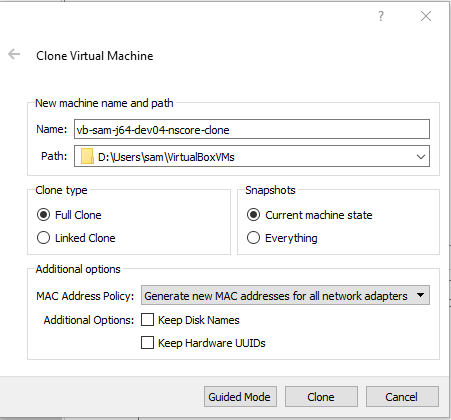
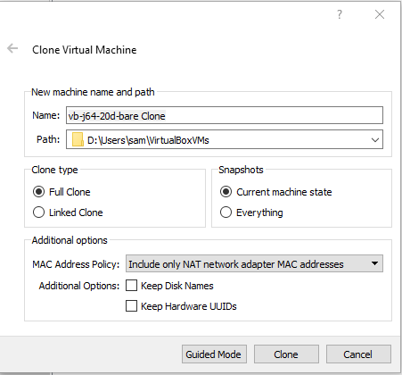
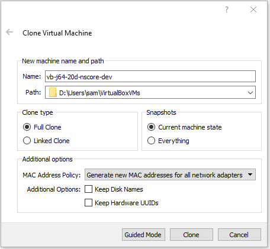

# VirtualBox / Clone VM #

The Clone tool makes a copy of a VM.
Cloning a VM may be appropriate for the following reasons:

* faster than taking the time to create and initialize a new VM
* create a copy of an appliance prior to making additional changes,
as a variation of the appliance
* a clone can include a history of snapshots for the VM,
whereas an exported appliance cannot
(and optionally the clone can discard the snapshots)

The following image illustrates illustrates a typical example of creating a clone.
First select a VM and then use the ***Clone*** tool (image of sheep, apparently a reference to the 
["Dolly" clone](https://en.wikipedia.org/wiki/Dolly_(sheep))).

**

**

**

Clone a Debian Jessie Virtual Machine (<a href="../images/clone.png">see full-size image</a>)

**

* ***Name*** - should be set to the new virtual machine name
* ***Path*** - OK to use the default location for VM files
* ***Clone Type*** - typically use ***Full Clone*** to ensure a clone with no dependencies
* ***Snapshots*** - Typically use ***Current machine state*** to ensure a clone with no dependencies
* ***Additional options***
	+ ***MAC Address Policy*** - typically use ***Generate new MAC addresses for all network adapters***
	to ensure that the clone has a different network hardware address than the original VM
	+ ***Keep Disk Names*** - typically **do not** check because want new names for the clone
	+ ***Keep Hardware UUIDs*** - typically **do not** check because want new UUIDs for the clone

It is important to recognize that the clone will be a copy of the original and additional changes
may be needed in order to make the clone unique, such as changing the hostname.
This is discussed below.

If a full clone is not used, there is risk that removing the VM completely will remove files used by other VMs.

## Example - Cloning an Appliance VM ##

This example illustrates cloning an appliance VM that is used as a basis for derived VMs.
In this example, the initial VM is an appliance for a bare Linux Jessie Debian operating system and the
goal is to clone that appliance so that additional software can be added suitable for a development environment.

After a clone is made, it will be necessary to change some configuration information so that the clone
is unique.  In particular, the hostname should be reset to avoid conflict with the original VM.

First select the VM of interest and then use the ***Clone*** tool in the ***VirtualBox Manager***.
Use the ***Expert Mode*** rather than ***Guided Mode***.

The following example shows the initial clone properties for the original VM appliance:

* The VM is an appliance, intended to be imported on other host computers.
The VM is named `vb-j64-20d-bare` indicating Debian Jessie 64-bit, 20 GB dynamic hard disk,
and bare operating system install.
* The default output location of files on the file system has been previously changed
to `D:\Users\sam\VirtualBoxVMs`,
rather than default location because the `D:\` drive has more space.
For the original VM:
	+ The VM is organized in a group ***Appliances*** in ***VirtualBox Manager***.
	+ This corresponds to the VM files being stored in
	`D:\Users\sam\VirtualBoxVMs\Applicances\vb-j64-20d-bar`.

**

**

**

Clone a Debian Jessie Virtual Machine - Initial Properties (<a href="../images/bare1.png">see full-size image</a>)

**

The edited settings are changed to the following:

**

**

**

Clone a Debian Jessie Virtual Machine - Edited Settings (<a href="../images/clone-bare2.png">see full-size image</a>)

**

The settings are as follows:

* ***Name*** - Changed to the desired name (additional configuration of the hostname is discussed below).
* ***Path*** - Because the VM is new, it has not yet been assigned to a group.
Therefore, don't attempt to set the path to other than the default.
The new VM can be moved into a group via the ***VirtualBox Manager***.
* ***Clone type*** - Use ***Full Clone*** so that the clone has its own hard disk file.
* ***Snapshots*** - Use ***Current machine state*** so that the clone is not cluttered up with old snapshots.
* ***Additional Options***:
	+ ***MAC Address Policy*** - Use ***Generate new MAC addresses for all network adapters***
	to ensure that the clone has a different network hardware address than the original VM.
	+ ***Keep Disk Names*** - Do not check because want new names for the clone.

Press ***Clone*** to create the clone.
Interestingly, the resulting VM is shown in the ***Appliances*** group in ***VirtualBox Manager***
(which is the group for the original VM)
but the files are in the folder `D:\Users\sam\VirtualBoxVMs\vb-j64-20d-nscore-dev`.

### Change Clone Hostname ###

A cloned VM will have a configuration that matches the original VM, including machine hostname.
To avoid confusion, the hostname should e changed before continuing with additional changes on the clone.
To change the hostname on a Debian Jessie VM, see

* [Procedure to Change Hostname on Linux VM](../procedures/procedures.md#procedure-to-change-hostname-on-linux-vm)
